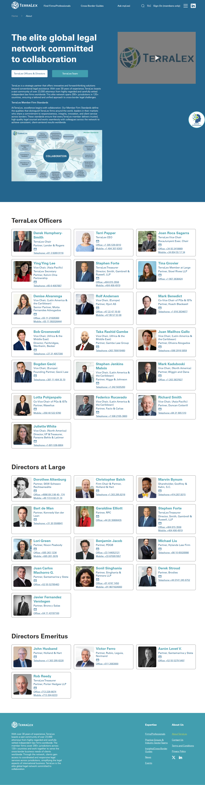

# About

**Live URL:** https://www.terralex.org/about
**Local file (target):** new file: about.html
**Page purpose:** Organizational overview that introduces TerraLex as an elite global legal network and presents its leadership, governance, and member-firm standards.

**Live screenshot:** [../screenshots/10-about.png](../screenshots/10-about.png)

## Current state — observations
- **Sections present on the live page:**
  - Brand intro / mission block — "strategic partner… innovative and forward-thinking solutions beyond conventional legal assistance," 30+ years, 23,000+ attorneys, 200+ jurisdictions, 120+ countries.
  - Member-firm standards feature — large branded standards graphic with copy on responsiveness, integrity, innovation, and client service.
  - **TerraLex Officers** — 9 positions (Chair, CEO, Vice Chair, Secretary, Treasurer, etc.), each card with headshot, name, title, firm affiliation, phone/mobile.
  - **Directors at Large** — 17 partner-level reps from member firms worldwide, same card format.
  - **Directors Emeritus** — 4 former leadership members, same card format.
  - No standalone history/timeline, no awards block, no editorial story.
- **Layout density:** moderate-to-high; uniform card grid for all 30 leadership entries with consistent spacing — heavy data, light narrative.
- **Imagery:** professional headshots in uniform dimensions; one branded standards graphic as the only feature image; no editorial photography.
- **Copy tone:** corporate-professional, prestige-leaning ("elite global legal network"), partnership-forward ("committed to collaboration"). Reads as authoritative but flat — no founder voice, no story arcs.
- **Navigation/CTAs:** standard top nav (Firms/Professionals, Guides, Ask myLexi, News, Events, About); no inline CTAs to firm directory or guides from the leadership grid.

## What works (Pros)
- **Comprehensive directory** — every officer, director, and emeritus is surfaced in one place; transparent governance.
- **Uniform card format** — scannable; consistent headshot dimensions look orderly across 30 entries.
- **Direct contact data** — phone/mobile on each card is unusually generous for a network site and signals approachability.
- **Strong positioning sentence** — "strategic partner… beyond conventional legal assistance" is a reusable hook.
- **Standards graphic** — one bold visual anchor breaks up the otherwise text-heavy page.

## What doesn't work (Cons)
- **No editorial hero** [UI][Content] — the page opens straight into prose; no full-bleed image, no display headline, no narrative entry point. Feels like an internal page, not a brand statement.
- **Wall-of-cards leadership grid** [UX] — 30 nearly identical cards in one stretch is fatiguing; no grouping cues beyond a heading, no filter, no search.
- **Mission block buried in body copy** [Content] — the "30+ years / 23,000+ attorneys / 200+ jurisdictions" credibility numbers are in a paragraph instead of a stats band.
- **No "by the numbers" panel** [UI] — same issue as legacy home; the strongest credibility device is missing.
- **No history / origin story** [Content] — for a 30-year-old network, the absence of a timeline or founder narrative is a missed differentiation moment.
- **No governance explanation** [Content] — officer titles are listed but there's no copy explaining how the board governs, how members are elected, or what the directors at large actually do.
- **Generic-corporate visual style** [UI] — same template feel as the rest of the legacy site; nothing signals "elite."
- **Contact-info density risks privacy/spam exposure** [UX][Accessibility] — phone numbers as plain text rather than `tel:` links or gated reveal.
- **No alt text confirmation on headshots** [Accessibility] — likely thin alt text given the bulk-card pattern.
- **Mobile leadership grid will be a long scroll** [Mobile] — 30 cards stacked single-column with no jump nav or section anchors.

## Redesign plan
- **Direction:** editorial hero ("Three decades. One network.") + story-driven sections (mission → history → standards) → a credibility "by the numbers" band → a structured leadership directory with grouped tabs (Officers / Directors / Emeritus) → governance explainer → CTA. Aim for fewer, denser moments of focus rather than a flat scroll of cards.
- **Component reuse from `index.html`:** `.site-header` (Bain-style two-row nav with Expertise mega-menu), full-bleed hero pattern (cf. `.hero` slide 1, simplified to a single static slide), `.s3-numbers` stat band (verbatim), `.s5-hero-band` pinned crossover for the mission/standards moment, `.s9-cta` for the closing pull-quote, `.site-footer`.
- **New components needed (page-local CSS only):**
  - `.about-history` — horizontal year-marker timeline (1985-style milestones, 30+ years).
  - `.about-leadership` — tabbed/filterable grid (Officers / Directors at Large / Emeritus) with a search input that filters by name, firm, or region; each card reuses card spacing and typography from `.s4-card`.
  - `.about-governance` — 2-column explainer (left: copy on how the board governs; right: simple org-chart SVG).
- **Typography & tokens:** inherit `ds-display`, `ds-h1`, `ds-thin`, `ds-bold`, `ds-eyebrow`, `ds-body-lg`, `ds-btn-*`, `on-dark` from `css/design-system.css`. No new tokens.

## Instructions for Claude Code (implementation brief)
1. Target file: `about.html` — **new file**. Scaffold from `index.html`'s `<head>`, header, and footer; copy them verbatim so nav, logo-swap behavior, and footer columns match.
2. Reuse without modification: `.site-header` + `.nav-topbar` + `.nav-mega`, `.s3-numbers` stat band (same six counters: 141 firms / 23,000+ lawyers / 207 jurisdictions / 35 years / 134 countries / 23 cross-border guides), `.s9-cta` quote section, `.site-footer`. Pull the same `<link>` tags to `css/design-system.css` and `css/responsive.css`.
3. Sections to build, in order:
   1. **Hero** — single-slide, on-dark, full-bleed editorial image; eyebrow "About TerraLex," display headline using `ds-thin` + `ds-bold` weight contrast (e.g., "Three decades. **One network.**"), one-line lede, primary CTA to "Find a Firm" + ghost CTA to "Ask myLexi."
   2. **Mission / story** — two-column: left copy block ("strategic partner… beyond conventional legal assistance"), right editorial image. Reuse `.s5-hero-band` typography scale.
   3. **History timeline** (`.about-history`) — horizontal scroll-snap row of 4-6 milestones (founding → 100th firm → digital launch → myLexi → today). Static markup, CSS-only animation.
   4. **By the numbers** — `.s3-numbers` block, identical to home.
   5. **Member-firm standards** — reuse the `.s5-standards` pattern from home (collaboration pill + 16-standards SVG connectors); link out to a standards detail anchor or the home equivalent.
   6. **Leadership directory** (`.about-leadership`) — tabbed: Officers (9), Directors at Large (17), Emeritus (4). Each card: headshot, name, title, firm, region. Phone/mobile gated behind a "Contact" hover/click reveal that uses `tel:` links. Include a sticky filter bar with a name/firm search input (client-side JS only, no backend).
   7. **Governance** (`.about-governance`) — short explainer copy on board structure and election cadence + a simple SVG org chart (Chair → Vice Chair → CEO → Secretary/Treasurer → Directors).
   8. **Closing CTA** — reuse `.s9-cta` with a pull quote on collaboration; primary CTA to "Find a Firm," ghost to "Cross-Border Guides."
   9. **Footer** — reuse `.site-footer` verbatim.
4. **Backend constraint:** no backend changes. All leadership data ships as a static JSON file in `data/leadership.json` (or inline `<script type="application/json">`) and is rendered client-side. Headshots ship as static assets under `assets/images/leadership/`. No CMS, no API.
5. Acceptance criteria:
   - Renders without console errors when served via `npx serve . -l 8080`.
   - Responsive at the project's existing breakpoints in `css/responsive.css`; leadership grid collapses to single-column on mobile with sticky tab bar still functional.
   - Header logo swaps white → default on scroll, identical to `index.html`.
   - `.s3-numbers` count-ups fire and never display 0 in the final state (apply same IntersectionObserver fix used on home).
   - All headshot `` tags have meaningful `alt` text (name + title).
   - All phone numbers are `tel:` links; emails (if any) are `mailto:` links.
   - Tab switching and search filter the directory client-side with no full reload.
