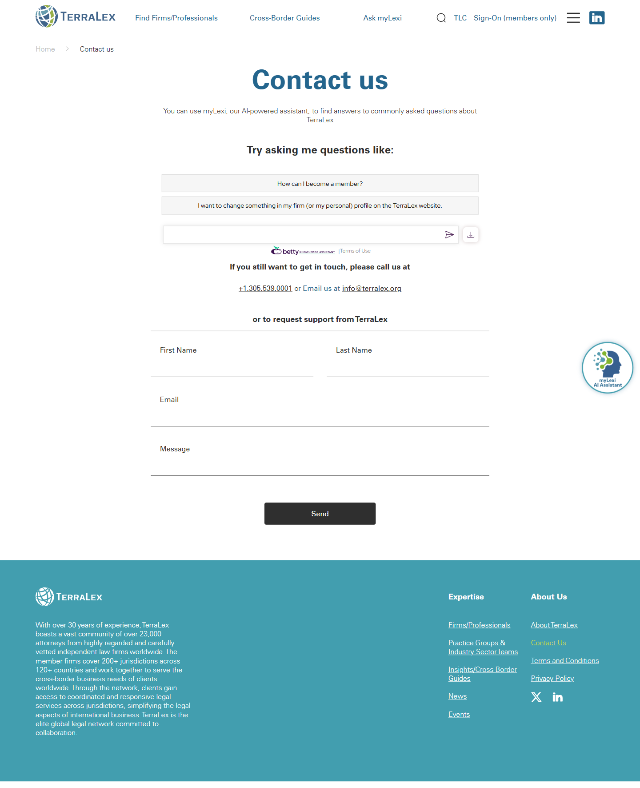

# Contact us

**Live URL:** https://www.terralex.org/contact-us
**Local file (target):** new file: contact-us.html
**Page purpose:** Contact page with myLexi prompt, phone/email, and a contact form for general support requests.

**Live screenshot:** [../screenshots/18-contact-us.png](../screenshots/18-contact-us.png)

## Current state — observations
- **Sections present on the live page:**
  - Single H1 "Contact us" with no hero image, no eyebrow, no full-bleed treatment.
  - One paragraph framing myLexi: "You can use myLexi, our AI-powered assistant, to find answers to commonly asked questions about TerraLex."
  - Direct contact info, plain text: phone `+1.305.539.0001` and a Cloudflare-obfuscated `[email protected]`.
  - Contact form labelled "to request support from TerraLex" — fields: First Name, Last Name, Email, Message; submit button "Send"; success state "Your Message has been delivered."
  - Standard footer (company description, expertise links, legal pages, X + LinkedIn).
- **Layout density:** sparse single column; everything stacks vertically with generous unstyled white space; form field widths feel arbitrary.
- **Imagery:** none on the page besides the myLexi wordmark/logo. No map, no HQ photo, no editorial visual.
- **Copy tone:** terse and functional. The myLexi line is the only narrative on the page; there is no "How can we help?" framing, no inviting lede, no explanation of what kinds of inquiries belong here vs. on a member-firm page.
- **Navigation/CTAs:** standard top nav; no inline CTAs to "Find a Firm" or "Ask myLexi" beyond the descriptive sentence; no closing CTA band.

## What works (Pros)
- **Form is short** — four fields total; low friction for a general inbox.
- **myLexi is surfaced first** — channels FAQ-style traffic away from the form, which is the right intent.
- **Direct phone + email visible** — no gating, no "submit a ticket" wall.
- **Cloudflare email obfuscation** — basic spam protection is in place.
- **Single, clear ask** — page does one job and doesn't try to be a directory.

## What doesn't work (Cons)
- **No hero / no warmth** [UI][Content] — page opens cold with a bare "Contact us" H1; no "How can we help?" framing, no editorial hero, no brand voice.
- **No HQ address, no office hours, no regional contacts** [Content] — for a 141-firm global network, surfacing only one Miami phone number under-represents the footprint.
- **Form and contact info compete vertically** [UX] — both stack in the same column; user has to scroll past the form to find phone/email or vice versa, instead of a clean two-column "form | direct contact" split.
- **Generic field set** [UX] — no Firm field, no Topic/reason dropdown (Membership inquiry / Press / Client referral / Technical / Other); everything funnels to one inbox with no triage signal.
- **No required-field marking, no inline validation cues visible** [Accessibility] — labels exist but error/help patterns are unclear.
- **Phone number is not a `tel:` link in any obvious way** [Accessibility][Mobile] — the live page uses a `callto:` scheme (legacy/Skype), not the standard `tel:` — broken on most modern mobile browsers.
- **Email obfuscation breaks copy-paste UX** [UX] — Cloudflare wrapper means the displayed string requires JS to resolve.
- **No map or visual anchor for HQ** [UI] — page reads as a placeholder, not a brand statement.
- **No closing CTA band** [Content] — page ends with the form and drops straight to footer; no cross-promo to "Find a Firm" or "Ask myLexi" for users who realize mid-form they're in the wrong place.
- **myLexi cross-promo is a sentence, not a card** [UI] — the strongest deflection device on the page is plain text.

## Redesign plan
- **Direction:** warm editorial hero with a clear ask ("How can we help?") + a balanced two-column body (form left / direct contact right) + a myLexi deflection card above the fold + a subtle map/imagery anchor + a closing CTA band. Keep the form short but add Firm and Topic for triage; restyle only — do not change the backend handler.
- **Component reuse from `index.html`:** `.site-header` + `.nav-topbar` + `.nav-mega` (verbatim), typography tokens (`ds-display`, `ds-h1`, `ds-thin`, `ds-bold`, `ds-eyebrow`, `ds-body-lg`, `ds-btn-*`), `.s9-cta` closing band pattern, `.site-footer` (verbatim).
- **New components needed (page-local CSS only):**
  - `.contact-hero` — compact on-dark hero, one display headline, one lede, no slider.
  - `.contact-grid` — two-column 7/5 split: form left, contact info card right; collapses to single column on mobile.
  - `.contact-form` — restyled wrapper around the existing form action; fields name / email / firm / topic (select) / message; submit reuses `ds-btn-primary`.
  - `.contact-info` — sticky-ish right column with HQ address block, `tel:` phone, `mailto:` email, office hours, and a short "Regional contacts" line that points to "Find a Firm."
  - `.contact-mylexi` — small cross-promo card above the grid: myLexi avatar, one line ("Quick question? Ask myLexi"), `Ask myLexi` button.
  - `.contact-map` — single static image or lightweight embed of the Miami HQ pin; decorative only.
- **Typography & tokens:** inherit from `css/design-system.css`. No new tokens.

## Instructions for Claude Code (implementation brief)
1. Target file: `contact-us.html` — **new file**. Scaffold from `index.html`'s `<head>`, header, and footer; copy them verbatim so nav, logo-swap behavior, and footer columns match.
2. Reuse without modification: `.site-header`, `.nav-topbar`, `.nav-mega`, `.s9-cta` band, `.site-footer`. Pull the same `<link>` tags to `css/design-system.css` and `css/responsive.css`.
3. Sections to build, in order:
   1. **Hero** (`.contact-hero`) — on-dark, no image-slider, eyebrow "Contact," display headline "How can we help?" using `ds-thin` + `ds-bold` weight contrast, one-line lede ("Talk to the TerraLex team about membership, the network, press, or client referrals."). No CTAs in the hero — the page itself is the CTA.
   2. **myLexi cross-promo** (`.contact-mylexi`) — full-width card directly under the hero: myLexi avatar/icon left, one-line copy ("Quick question? myLexi, our AI assistant, answers most common questions about TerraLex instantly."), `ds-btn-primary` "Ask myLexi" linking to `mylexi.html`.
   3. **Two-column body** (`.contact-grid`) — `grid-template-columns: 7fr 5fr; gap: 64px;`:
      - **Left — `.contact-form`:** keep the live site's form action/method (whatever endpoint it currently posts to); restyle only. Fields in order: Name (single field, replaces First/Last), Email, Firm (text), Topic (select: Membership inquiry / Client referral / Press & media / Technical issue / Other), Message (textarea, 4 rows). All required except Firm. Submit button "Send message" using `ds-btn-primary`. Inline label-above style; show validation state on blur using native HTML5 only.
      - **Right — `.contact-info`:** card with four blocks: (a) HQ address (placeholder "TerraLex Global, Miami, FL, USA" — flag for client copy); (b) phone as `tel:+13055390001` formatted `+1 305 539 0001`; (c) email as `mailto:` (no Cloudflare obfuscation needed in a static page; can keep CF wrapper if backend re-injects it); (d) office hours line ("Mon-Fri, 9am-5pm ET"); (e) one line "For local matters, find a member firm in your jurisdiction." with a ghost CTA to `firms.html`.
   4. **Map / imagery** (`.contact-map`) — single static image (Miami skyline or a styled static map PNG) full-bleed, ~280px tall, decorative; no interactive embed (avoids third-party JS).
   5. **Closing CTA** — reuse `.s9-cta` with copy "Looking for a lawyer, not a network?" + primary CTA "Find a Firm" → `firms.html`, ghost CTA "Browse Cross-Border Guides" → guides page.
   6. **Footer** — reuse `.site-footer` verbatim.
4. **Backend constraint:** form submission uses whatever backend the live site currently uses. Do **not** propose a new form handler, CRM integration, or serverless function. Preserve the existing `<form action>` and `method` attributes; only restyle markup, labels, and field set. The new Firm and Topic fields can post as additional form-data keys — if the existing handler ignores them, that's acceptable for this restyle. No backend code in scope.
5. Acceptance criteria:
   - Renders without console errors when served via `npx serve . -l 8080`.
   - Responsive at existing breakpoints in `css/responsive.css`; two-column grid collapses to single column on mobile with form first, contact info second.
   - Header logo swaps white → default on scroll, identical to `index.html`.
   - Phone is a working `tel:` link; email is a working `mailto:` link (or preserves Cloudflare obfuscation if the existing backend requires it).
   - Form posts to the same endpoint as the live site and returns to the same success state pattern; no JS form handler added.
   - All form fields have associated `<label for>` and visible focus states; Topic select is keyboard-navigable.
   - "Ask myLexi" card and closing CTA both link to existing site routes (`mylexi.html`, `firms.html`).
