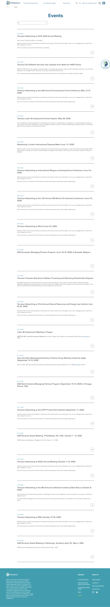

# Events

**Live URL:** https://www.terralex.org/events
**Local file (target):** new file: events.html
**Page purpose:** Events index listing upcoming and past TerraLex meetings, regional events, and webinars in one filterable, scannable archive.

**Live screenshot:** [../screenshots/09-events.png](../screenshots/09-events.png)

## Current state — observations
- Page is JS-rendered: at WebFetch time the body shows ~30 "Loading..." placeholder rows and never resolves to populated content for an unauthenticated/no-JS crawl. First paint is visibly empty for any agent that doesn't run scripts.
- Above the loading list sits a single H1 **"Events"** with one visible category control labelled **"All"** (a dropdown, not a pill row). No secondary filters (region, year, event type, search) are exposed.
- No hero band, no introductory copy, no imagery, no featured-event slot — the page jumps straight from the standard site header to the bare list.
- No calendar view, no map view; the underlying widget appears to be a vertical list of 30+ uniform rows rather than a card grid.
- Card/row anatomy cannot be confirmed from the HTML (rows are placeholder text), but the homepage Events tease and live `/events` route both imply minimal metadata per row — likely just title, date, possibly location. No imagery is referenced in the markup.
- No upcoming-vs-past split is visible in the DOM; both sets appear to live in the same flat list filtered by the "All" dropdown.
- No per-event detail-page URLs were discoverable: the rendered HTML exposes zero `/events/[slug]` hrefs, the homepage only links to `/events` (no individual event teases), `sitemap.xml` returns 404, and Google/Bing/DuckDuckGo `site:` searches were blocked by consent walls or empty results. **Detail pages may exist behind the JS render but could not be confirmed.**
- No RSVP, registration, or "Add to calendar" CTA pattern is visible at index level. The homepage's "view more events" tease feeds straight into this index without a registration funnel.
- Footer is the standard TerraLex footer; cookie banner overlays first paint as elsewhere on the site.

## What works (Pros)
- **Single source of truth** — one `/events` route covers meetings, regional events, and webinars rather than splitting them across micro-sites.
- **"All" filter affordance present** — the scaffolding for category filtering is already there to build on.
- **Homepage cross-link** — `/events` is reachable from the main nav and a homepage Events block, so the route's discoverability is solid.
- **Lightweight DOM** — once populated, the flat list will be fast to scan for users who already know what they're looking for.

## What doesn't work (Cons)
- **No-JS / slow-network users see only "Loading..." placeholders** [UX][Accessibility] — the page never server-renders, so crawlers, screen readers, and slow connections get nothing.
- **No hero, no copy, no imagery, no featured event** [UI][Content] — for an "elite global legal network" the events front door is visually inert; nothing communicates scale or signals which event is most important.
- **Single "All" dropdown is the entire filter set** [UX] — no Region, no Event Type (Global Meeting / Regional / Webinar / Networking), no Year, no free-text search, no upcoming-vs-past toggle.
- **Upcoming and past appear merged into one flat list** [UX] — visitors looking for "what's next" must scroll past archive entries; visitors researching past events have no archive view.
- **Row metadata is thin** [Content] — no hosting firm, no location flag, no event-type tag, no thumbnail; users can't triage at a glance.
- **No visible RSVP/Registration CTA pattern** [UX][Content] — the index doesn't surface "Register" buttons, capacity, or member-only badges; the path from awareness to attendance is unclear.
- **No per-event detail pages confirmed from the index** [UX] — if individual `/events/[slug]` pages exist they aren't crawlable, and if they don't, the listing is a dead end. (Flag: this needs JS-rendered confirmation; an event-detail brief should be added once verified.)
- **Visual style is undersigned and dated** [UI] — flat list with default link color, no typographic hierarchy beyond H1, out of step with the redesigned `index.html`.
- **Mobile filter affordance unknown** [Mobile] — the desktop "All" dropdown gives no signal of a sticky filter bar or bottom-sheet pattern.
- **Cookie banner overlays content on first paint** [Accessibility] — same site-wide issue as other pages.

## Redesign plan
- Reframe the page top-down: site header → dark hero band → **featured next event** card → sticky filter bar → **upcoming events grid** → **past events archive** → CTA band → footer.
- **Featured next event** uses the homepage `s6-event` card vocabulary at full width: full-bleed image, date pill with auto "in N days" decoration, host firm + city, headline, short description, primary CTA ("View event" — links to local `event.html?slug=…` placeholder, no backend).
- **Upcoming grid** = `.s6-event` cards in a 3-up desktop / 2-up tablet / 1-up mobile layout; date pill, event-type tag, city + hosting firm, hover reveal with description, "Read more" arrow.
- **Past events archive** uses a denser variant of the same card (smaller image, muted treatment, "Past" tag) — same grid, separated by an `s5-hero-band`-style divider with copy "Past meetings & webinars".
- **Filter bar** (sticky): Event Type (Global Meeting / Regional / Webinar / Networking), Region (dropdown sourced from the homepage Expertise taxonomy), Year (dropdown, past archive only when "Past" is active), free-text search, View toggle (List | Calendar — calendar is a front-end-only month grid). Active filter chips with "Clear all".
- **No backend** — events are read from a local static `data/events.json` (slug, title, date, endDate, type, region, country, city, hostFirm, image, description, registerUrl). Filtering, sorting, pagination, and the "in N days" decoration are all client-side, mirroring how `.s6-event` already auto-decorates dates in `index.html`.
- **Visual language alignment** with `index.html`: Source Sans 3 + DM Sans, `ds-display` / `ds-h1` / `ds-h3` / `ds-eyebrow` scale, `ds-accent` highlight, dark hero band, white grid section, `ds-btn-primary` / `ds-btn-outline` buttons, the `.s9-cta` pull-quote pattern at the bottom, the same footer block.
- **Component reuse from `index.html`**: header (`.site-header` + `.nav-topbar` + `#mainNav` + `.nav-mega`), event card (`.s6-event` + `.s6-event-bg` + `.s6-event-date` + `.s6-event-title` + `.s6-event-reveal` + `.s6-event-link`), tag chip (`.s3b-tag`), section hero (`.s5-hero-band` / `.s8-hero`), CTA band (`.s9-cta`), footer (`.site-footer`). Tokens from `css/tokens.css` and `css/design-system.css`.

## Instructions for Claude Code (implementation brief)
1. Target file: `events.html` — new file. Page-specific styles in a new `css/events.css`; page-specific JS in a new `js/events.js`. Local dataset in a new `data/events.json`.
2. Reuse from `index.html` and `css/`: header markup + classes (`.site-header`, `.nav-topbar`, `#mainNav`, `.nav-links`, `.nav-mega`), footer (`.site-footer`), typography utilities (`ds-display`, `ds-h1`, `ds-h3`, `ds-eyebrow`, `ds-body`, `ds-body-sm`, `ds-thin`, `ds-bold`, `ds-accent`, `on-dark`), buttons (`ds-btn`, `ds-btn-primary`, `ds-btn-outline`, `ds-btn-ghost`, `ds-btn-lg`), event card (`.s6-event` + child classes — including the `data-event-date` "in N days" auto-decoration logic from `index.html`), tag chip (`.s3b-tag`), section-hero band (`.s5-hero-band`), CTA quote section (`.s9-cta`). Load order: `css/tokens.css`, `css/base.css`, `css/header.css`, `css/design-system.css`, `css/responsive.css`, then `css/events.css` last.
3. Sections to build, in order:
   1. Site header (utility bar + main nav, identical to `index.html`).
   2. Hero band — full-width dark image, eyebrow "Events & Webinars", H1 "Where the network meets", one-line sub ("Global meetings, regional gatherings, and webinars across 134 countries."), no CTA.
   3. Featured upcoming event — full-bleed `.s6-event`-style hero card showing the next chronological event from `data/events.json` with date pill ("in N days"), event-type tag, host firm + city, headline, short description, primary CTA "View event".
   4. Sticky filter bar — Event Type (segmented pills: All / Global Meeting / Regional / Webinar / Networking), Region (dropdown), Year (dropdown, hidden until "Past" tab active), free-text search, View toggle (List | Calendar), result count on the right ("12 upcoming events"). Active-filter chips + "Clear all" below.
   5. Upcoming events grid — `.s6-event` cards, 3-up desktop / 2-up tablet / 1-up mobile, sorted ascending by date, cards link to `event.html?slug=…` (placeholder route, OK if 404s — flag for later).
   6. Past events archive — section divider (`.s5-hero-band` style) with "Past meetings & webinars" eyebrow + H2; same grid below in a muted variant (`.s6-event.is-past`), sorted descending by date, paginated 12 per page with a "Show more" button (front-end pagination).
   7. Calendar view (toggled, same dataset) — front-end-only month grid with event dots; click a dot scrolls to / opens the matching card. No new backend.
   8. Empty state — illustration + "No events match these filters" + "Reset filters" button when a filter combo returns zero.
   9. CTA band reusing `.s9-cta` — "Hosting an event? Let the network know." with `ds-btn-primary` + `ds-btn-outline`, links to `/contact-us` placeholder.
   10. Site footer (identical to `index.html`).
4. **Backend constraint:** no terralex.org API, no RSVP backend, no calendar-sync APIs, no email-capture. Build against a local static `data/events.json` snapshot (slug, title, date ISO, endDate ISO, type, region, country, city, hostFirm, image, description, registerUrl). All filtering, sorting, pagination, "in N days" decoration, and calendar rendering are client-side only. The "Register" / "View event" buttons may link out to external `registerUrl` strings already in the JSON (no backend needed) or fall back to a `mailto:` placeholder.
5. Acceptance criteria: visually consistent with `index.html` (typography scale, button system, card hover/reveal pattern, color tokens, date-pill auto "in N days"); responsive at desktop ≥1280, tablet 768–1279, mobile ≤767; sticky filter bar collapses to a single "Filters" button opening a bottom-sheet on mobile; keyboard-accessible filters and cards with visible focus rings; no console errors when served via `npx serve . -l 8080`.
