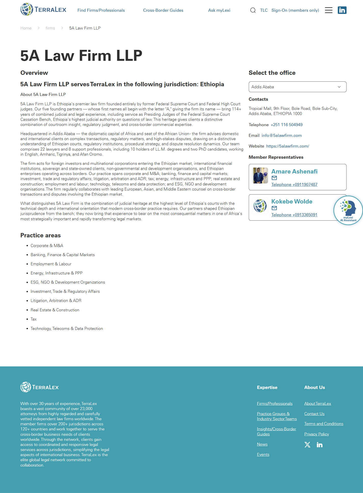

# Firm profile

**Live URL (representative):** https://www.terralex.org/firms/5a-law-firm-llp
**Local file (target):** firm.html (fresh redesign)
**Page purpose:** Templated single-firm profile page presenting overview, practice areas, offices and contacts for one TerraLex member firm.

**Live screenshot:** [../screenshots/03-firm-profile.png](../screenshots/03-firm-profile.png)

## Current state — observations
- Top-to-bottom flow: site header (logo, search, primary nav with Find Firms/Professionals, Cross-Border Guides, Ask myLexi, Member Sign-on; secondary "Find Expertise" mega-dropdown and LinkedIn link) → breadcrumb (Home > Firms > 5A Law Firm LLP) → page title block ("5A Law Firm LLP" + jurisdiction subline "Serves TerraLex in Ethiopia") → "Overview" prose → "Practice areas" bullet list → "Select the office" dropdown with "Contacts" → footer.
- Title block is a plain text headline with no hero image, no firm logo, no flag/region cue, and no quick-fact strip (founded year, lawyer count, office count, languages).
- "Overview" is a single text-heavy block of 4–5 paragraphs describing founding partners, lawyer headcount (22 lawyers, 8 support staff), language capabilities, and client base — no pull quotes, no stats callout, no portrait imagery.
- "Practice areas" is rendered as a flat unordered bullet list of ~10 items (Corporate & M&A, Banking/Finance, Energy/Infrastructure, Technology/Telecoms, ESG/NGO, etc.) with no grouping, icons, depth indicators, or links to the matching Practice Group hub pages.
- Office selector is a single dropdown (only "Addis Ababa" option) — no address, phone, email, map, hours, or office photo. Clicking surfaces a "Contacts" heading whose body reads "No representatives" — a dead-end for the user's primary task.
- No attorneys/people grid: founding partners are referenced in the prose ("five founding partners — whose first names all begin with the letter 'A'") but never listed as cards with names, titles, photos, or contact actions.
- No "related firms" / "other firms in this region" rail, no "request introduction" CTA, no link to TerraLex's regional or practice-group pages, no language toggles, no tags/filters, no expand/collapse, no tabs.
- Visual hierarchy: institutional and formal — generous whitespace, body-weight type, minimal contrast between sections; the page reads as a Word document rather than a designed profile.
- Page footer is the standard two-column TerraLex footer (network description + Expertise / About Us link groups + social).

## What works (Pros)
- Breadcrumb pattern (Home > Firms > Firm name) is clear and SEO-friendly — preserve and echo.
- Formal copy tone matches the audience (in-house counsel, GCs, partners) — keep authoritative voice.
- Generous whitespace gives the prose room to breathe — preserve the editorial feel for the overview block.
- Single-firm-per-jurisdiction context is a strong differentiator and worth surfacing more prominently.

## What doesn't work (Cons)
- No firm logo, hero image, or jurisdiction flag — the page feels generic and undifferentiated from any other firm on the network. [UI]
- "No representatives" under Contacts is a dead-end for the primary user task (reach a person at this firm). [UX][Content]
- Practice areas as a flat bullet list provides no scannability and no link-out to the matching Practice Group hubs — wasted cross-link opportunity. [UX][Content]
- No attorneys/key-contacts grid — partners are mentioned in prose but never individualized; users cannot identify or contact them. [UX][Content]
- No quick-fact strip (founded, lawyers count, languages, offices) — buried inside paragraph 3 of the overview. [UI][Content]
- No map of office locations — hard to grasp jurisdiction footprint at a glance. [UI]
- Office selector dropdown is overkill for a single office and hides what little address data should be visible. [UX]
- No "related firms in region" or "back to firms directory" rail — user cannot pivot to neighbouring jurisdictions. [UX]
- Heading hierarchy is shallow (H1, then a sea of H2s) with little weight contrast — entire page reads as one long text block. [UI][Accessibility]
- No skip-link, no semantic landmarks confirmed for the dropdown, no visible focus styling. [Accessibility]
- Mobile: bullet list and dropdown collapse acceptably but the title block has no responsive type ramp and no thumb-reachable contact CTA. [Mobile]
- Copy density: 4–5 paragraphs of overview without subheads or pull quotes — high cognitive load. [Content]

## Redesign plan
- High-level direction: turn the firm profile from a text page into a **firm "card writ large"** — a confident hero with firm name, jurisdiction badge, logo and a quick-fact strip; a structured directory of attorneys (key contacts); a single map showing the office(s); practice areas rendered as a tag grid that links to Practice Group hubs; and a clear contact / "request an intro" CTA.
- Visual language alignment with `index.html`: reuse the navy-on-cream palette via `css/tokens.css`, the `Source Sans 3` + `DM Sans` typography stack, the `ds-display` / `ds-thin` / `ds-body-lg` heading system, and the `ds-btn ds-btn-primary` / `ds-btn-ghost` button system already loaded by `css/design-system.css`.
- Component reuse from `index.html`: site `<header class="site-header">` and footer (lift directly), `ds-display` headline treatment from the hero, the Section 4 "card system" (image-top card with title + meta) for the attorneys grid, the Section 6 stat-strip pattern for the firm quick-facts, the News & Insights tag chip styling for practice-area tags, and the existing scroll-driven section reveal hooks where appropriate.
- Hero treatment: full-width navy band with firm name in `ds-display` + thin jurisdiction kicker (mirrors slide-1 headline pattern), firm logo lockup right-aligned, a quick-fact horizontal strip beneath (Founded · Lawyers · Offices · Languages).
- Attorneys directory: grid of key-contact cards (photo, name, title, practice tags, email/LinkedIn icons) — front-end-only, populated from a static JSON stub for the prototype since live data is not exposed.
- Locations: single static map image or CSS-based dot-on-globe echo of the homepage globe motif, with one card per office (address, phone, hours).
- Practice areas: chip/tag grid linking to `/practice-groups-...` hubs, grouped if ≥8 items.
- Bottom rail: "Other TerraLex firms in <region>" — three-card carousel reusing the firm-card component from the firms directory.

## Instructions for Claude Code (implementation brief)
1. Target file: `firm.html` — fresh rewrite (existing local file is discarded; do not preserve any of its structure or styles).
2. Reuse, do not duplicate: `<header class="site-header">` markup and the footer block from `index.html`; load the same stylesheet chain (`css/tokens.css`, `css/base.css`, `css/header.css`, `css/sections.css`, `css/design-system.css`, `css/responsive.css`); use the `ds-display`, `ds-thin`, `ds-body-lg`, `ds-btn`, `ds-btn-primary`, `ds-btn-ghost`, `on-dark` utility classes; reuse the card, chip, and stat-strip patterns from `index.html` Sections 4–6; reuse Source Sans 3 / DM Sans font links already declared.
3. Sections to build, in order:
   1. Site header (lifted from `index.html`).
   2. Breadcrumb row (Home > Firms > [Firm name]) — sticky just below header on scroll.
   3. Hero band — firm name (`ds-display`), thin jurisdiction kicker, firm logo lockup, primary CTA "Request an introduction" + secondary "Visit firm website".
   4. Quick-facts strip — Founded · Lawyers · Offices · Languages (4 stat tiles, full-width on desktop, 2x2 on tablet, stacked on mobile).
   5. Overview — two-column layout on desktop (prose left, pull-quote / "Why this firm" callout right); single column on mobile.
   6. Key contacts — heading "Key contacts", 3–4 attorney cards (photo, name, title, practice tags, email, LinkedIn) populated from a static JS array stub.
   7. Attorney directory — heading "Our team", responsive grid of attorney cards with simple front-end filter chips (practice area, seniority); static JSON source.
   8. Offices & locations — static map image or globe-echo motif + card list (address, phone, email, hours) — one card if single office, multi-card grid if more.
   9. Practice areas — chip grid linking to existing `/practice-groups-Industry-sector-teams/groups/...` URLs.
   10. Related firms in region — three-card horizontal rail reusing the firm-card component, with "View all firms in [Region]" link to the firms directory.
   11. Closing CTA band — "Need counsel in [Country]?" with `ds-btn-primary` "Request an introduction".
   12. Site footer (lifted from `index.html`).
4. **Backend constraint:** front-end only. Do not propose new APIs, data-schema changes, search re-indexing, auth flows, or any terralex.org server-side work. Attorney photos, key-contact lists, office addresses and related-firm rails are populated from a static JS stub (`firmData.js` or inline `<script>`) for the prototype — no live data binding required. Locally we serve via `npx serve . -l 8080`.
5. Acceptance criteria: visual fidelity to the new homepage language (navy + cream, `ds-display` typography, card system); responsive at the project's existing breakpoints (mobile ≤ 720, tablet 721–1024, desktop ≥ 1025); zero console errors when served via `npx serve . -l 8080`; all section anchors keyboard-reachable and breadcrumb / CTAs operable without a mouse.
