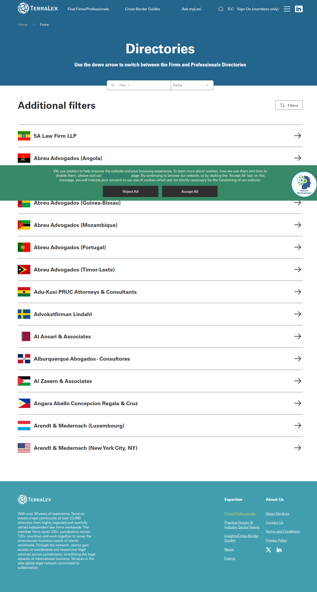

# Firms

**Live URL:** https://www.terralex.org/firms
**Local file (target):** firms.html (fresh redesign)
**Page purpose:** Filterable directory of every TerraLex member law firm across 200+ jurisdictions, letting visitors locate counsel by name, region or country.

**Live screenshot:** [../screenshots/02-firms.png](../screenshots/02-firms.png)

## Current state — observations
- Page is a "Directories" hub, not a dedicated Firms page: a single H1 "Directories" sits above an awkward dropdown that switches between the Firms list and the Professionals list ("Use the down arrow to switch…"). Firms is the default view.
- Layout is a plain top-down stack: utility/main nav, page heading, "Additional filters" toggle, "Filters" sidebar (left), and a vertical results list on the right. No hero image, no introductory copy, no map.
- Each firm row is a minimal card/line: country flag icon + firm name as a hyperlink. No city, no practice tags, no logo, no firm photo, no preview blurb. Multi-office firms (e.g. Abreu Advogados — Angola, Cabo Verde, Guinea-Bissau, Mozambique) are listed as separate rows, one per jurisdiction.
- Results are grouped/sorted alphabetically by firm name (5A Law Firm LLP… Abreu Advogados…). No A–Z jump nav, no visible "load more" or numbered pagination — appears to be one long scrolling list.
- Filter rail labels are generic ("Filters", "Additional filters") with no obvious option counts or active-filter chips. The inferred filterable axes are Region/Country and Practice/Industry, but the affordances are weak and discovery is poor.
- Footer is the standard TerraLex footer (about copy, expertise links, X + LinkedIn). A cookie consent banner sits over the bottom of the viewport. Breadcrumbs are absent.
- Mobile experience is not differentiated from desktop in any visible way; the sidebar likely collapses but no mobile-first filter affordance (e.g. bottom-sheet) is evident.

## What works (Pros)
- Country flags give a quick visual anchor for a globally-scoped directory.
- Firm name links straight through to the firm profile — single-click path to detail.
- One-row-per-jurisdiction makes multi-office networks (Abreu, Garrigues, etc.) honest about their geographic spread.
- Alphabetical default is predictable for users who already know the firm name.
- Lightweight DOM keeps the list fast to scan once you're scrolling.

## What doesn't work (Cons)
- Combining Firms + Professionals under a single "Directories" heading hides the Firms purpose and forces a mode-switch most users don't need. [UX]
- Cards carry only flag + name — no city, practice, size, year-joined, or logo, so users must click into every candidate to compare. [Content]
- No visible free-text search box on the firms view — users with a known firm name must scroll. [UX]
- Filter labels ("Filters", "Additional filters") are unclear; there are no active-filter chips, counts, or "Clear all" affordance. [UX]
- No alphabet jump-nav and no pagination on a 140+ firm list means a long, undifferentiated scroll. [UX]
- Visual design is undersigned and dated: heavy left rail, flat list, default link blue, no typographic hierarchy beyond H1. Out of step with the new homepage. [UI]
- No map or regional view — paradoxical for a "200+ jurisdictions" network whose primary value prop is global coverage. [UX]
- Color contrast on body links and flag icons looks low at small sizes; flag icons are decorative without alt text or visible country label next to the firm. [Accessibility]
- Mobile: sidebar filter pattern doesn't translate well to small screens and there's no obvious sticky filter button. [Mobile]
- No empty/zero-results state copy is visible; filter combinations that return nothing likely just show a blank list. [UX]
- Cookie banner overlays content with no easy dismiss path on first paint. [Accessibility]

## Redesign plan
- Split intent: this page is **Firms only**. The Professionals directory becomes its own route. A small toggle at the top can still cross-link, but the page headline becomes "Member Firms".
- New layout, top-down: site header → compact hero band ("Find counsel in 134 countries") with a single prominent search input → sticky filter bar (Region, Country, Practice, Industry) → results grid → load-more or A–Z rail → standard footer.
- Replace the line-item list with a **firm card grid** (3-up desktop / 2-up tablet / 1-up mobile) using the homepage's `s3b-card` / `s6-event` card vocabulary: flag chip, firm name (`ds-h3`), city + jurisdiction (`ds-body-sm`), practice tags pulled from existing taxonomy, hover reveal with "View firm" arrow link.
- Add a secondary **Map view toggle** (List / Map). Map is purely a visual filter on the *existing* firm dataset (lat/lon already available in `gDots`/`firmDots` from `index.html`) — no new backend.
- Filters render as pill chips with counts; selected filters appear as removable chips above the grid; provide "Clear all". Region and Country are dropdowns with type-ahead; Practice and Industry are multi-select dropdowns sourced from the existing Expertise taxonomy already shown in the homepage mega menu.
- Visual language alignment with `index.html`: Source Sans 3 + DM Sans, `ds-display`/`ds-h1`/`ds-h3`/`ds-eyebrow` scale, accent color via `ds-accent`, dark hero band with overlay image, white results section, the same `ds-btn` primary/ghost buttons, the same footer block.
- Component reuse: header (`#siteHeader` + `#mainNav` + utility bar), footer (`.site-footer`), card hover/reveal pattern (`s6-event` + `s4-card`), CTA pill (`ds-btn ds-btn-primary`), tag chip (`s3b-tag`), grid utilities from `css/sections.css`, tokens from `css/tokens.css` and `css/design-system.css`. Page-specific styles in `css/firms.css` (replace existing).
- Empty state, loading skeleton, and accessible focus rings are part of the redesign — all front-end-only.

## Instructions for Claude Code (implementation brief)
1. Target file: `firms.html` — fresh rewrite. Discard the current `firms.html` markup and the body of `css/firms.css`; keep only the file paths so existing links don't break. Page-specific JS lives in a new `js/firms.js`.
2. Reuse from `index.html` and `_design/`: header markup + classes (`.site-header`, `.nav-topbar`, `#mainNav`, `.nav-links`, `.nav-mega`), footer markup (`.site-footer`), typography utilities (`ds-display`, `ds-h1`, `ds-h3`, `ds-eyebrow`, `ds-body`, `ds-body-sm`, `ds-thin`, `ds-bold`, `ds-accent`, `on-dark`), button utilities (`ds-btn`, `ds-btn-primary`, `ds-btn-ghost`, `ds-btn-outline`, `ds-btn-lg`), card hover pattern from `.s6-event` and reveal pattern from `.s4-card-reveal`, tag chip from `.s3b-tag`, color/spacing tokens from `css/tokens.css`. Load `css/tokens.css`, `css/base.css`, `css/header.css`, `css/design-system.css`, `css/responsive.css`, then `css/firms.css` last.
3. Sections to build, in order:
   1. Site header (utility bar + main nav, identical to `index.html`).
   2. Compact hero band — full-width dark image, eyebrow "Member Firm Directory", H1 "Find counsel across 134 countries", one-line sub, single search input with magnifier icon (placeholder: "Search by firm name or city").
   3. Sticky filter bar — Region (dropdown), Country (type-ahead dropdown), Practice (multi-select), Industry (multi-select), View toggle (List | Map), result count on the right ("141 firms").
   4. Active-filter chip row + "Clear all" link (hidden when empty).
   5. Results grid — firm cards (flag chip, firm name, city · jurisdiction, 1–3 practice tag chips, hover reveal with "View firm" arrow). 3-up desktop, 2-up tablet, 1-up mobile. Cards link to `firm.html?slug=…`.
   6. Map view (toggled, same dataset) — reuse a static SVG/canvas world projection styled like the homepage globe; pins for each firm; click pin → flies card into view. No new backend; data is a local JSON array of firms with lat/lon, mirroring `firmDots[]` from `index.html`.
   7. Empty state — illustration + "No firms match these filters" + "Reset filters" button. Required when filter combo returns zero.
   8. Load-more button (front-end pagination, 24 per page) plus a discreet A–Z rail on desktop right edge for direct alphabet jump.
   9. CTA band reusing `s9-cta` styling — "Can't find what you're looking for? Ask myLexi." with the homepage's primary + outline buttons.
   10. Site footer (identical to `index.html`).
4. **Backend constraint:** no terralex.org API or schema changes. Build against a local static `data/firms.json` snapshot (name, slug, city, country, region, lat, lon, practices[], industries[], flagCode). Search and filtering are client-side only. Map view consumes the same JSON.
5. Acceptance criteria: visually consistent with `index.html` (typography scale, button system, card hover pattern, color tokens); responsive at the project's existing breakpoints (desktop ≥1280, tablet 768–1279, mobile ≤767); sticky filter bar collapses to a single "Filters" button that opens a bottom-sheet on mobile; keyboard-accessible filters and cards (visible focus rings, ESC closes dropdowns); no console errors when served via `npx serve . -l 8080`; Lighthouse a11y score ≥ 95 on the page.
