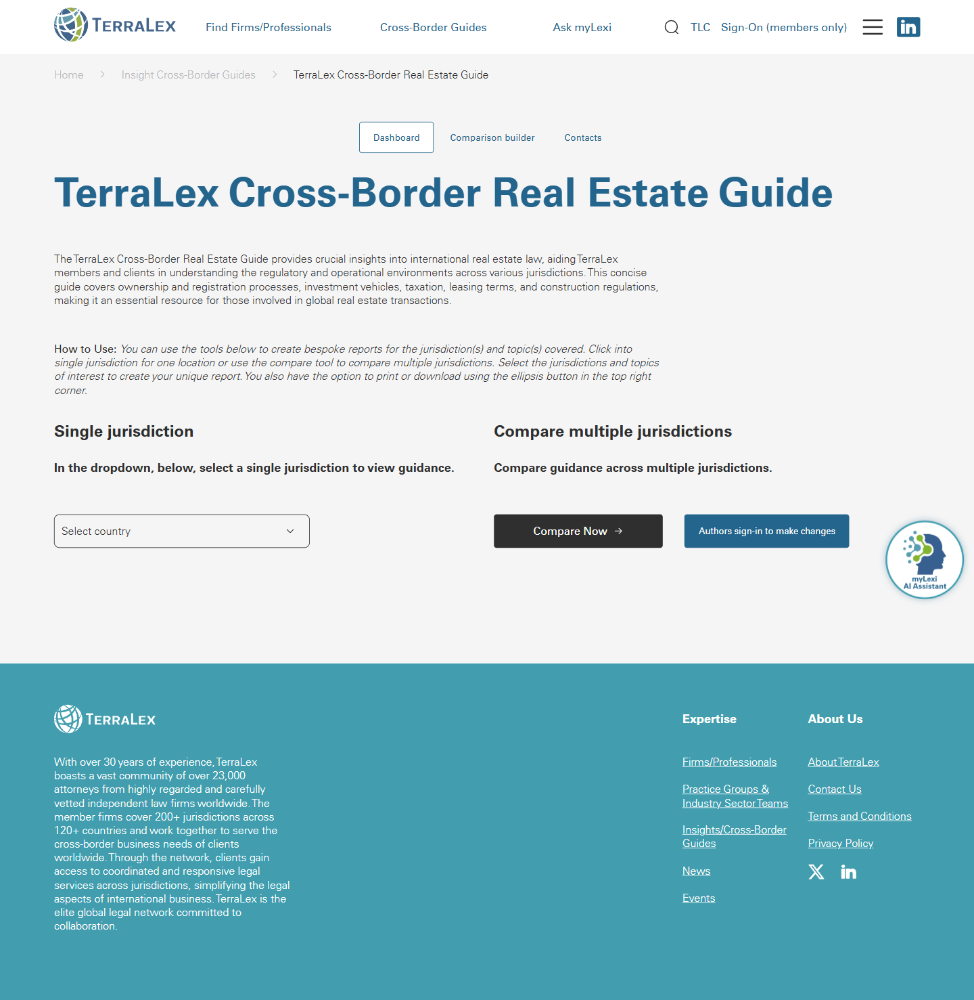

# Guide detail

**Live URL (representative):** https://www.terralex.org/insights-cross-border-guides/terralex-cross-border-real-estate-guide
**Local file (target):** new file: guide-detail.html
**Page purpose:** Templated detail page for a single TerraLex Cross-Border Guide, presenting jurisdiction-by-jurisdiction Q&A content with the ability to read one country at a time or compare multiple.

**Live screenshot:** [../screenshots/05-guide-detail.png](../screenshots/05-guide-detail.png)

## Current state — observations
- Hero is a thin title block: H1 ("TerraLex Cross-Border Real Estate Guide") plus a single paragraph describing scope (ownership, registration, investment vehicles, tax, leasing, construction). No hero image, no publish/updated date, no author or contributor byline, no breadcrumb beyond a small "Home > Insight Cross-Border Guides" trail.
- Jurisdiction access is a **dual-access model**: (1) a single dropdown that loads one jurisdiction's guidance, (2) a "Compare Now" CTA that opens a separate comparison interface to view multiple jurisdictions side-by-side.
- No visible sticky table of contents, no accordion, no anchor nav, no sidebar on the detail page itself — the guide effectively defers all content discovery to the dropdown / comparison tool.
- Content density on the landing/detail page is very low — it reads like a stub. Substantive Q&A content lives one click deeper, behind the jurisdiction selector.
- No imagery, no map, no flag chips for jurisdictions covered, no count of jurisdictions, no contributor-firm logos on the landing.
- Print/download is hidden behind a tiny ellipsis (...) button in the top-right corner. Format isn't surfaced (PDF? print stylesheet?).
- Footer is global TerraLex chrome (23,000 attorneys line, firm directory, practice groups, news links) plus a "Stay up to date" email signup. No "related guides" rail. No cross-links to other Cross-Border Guides.
- Typography is clean and serifed-corporate, generous whitespace, but the page reads thin and undifferentiated from a generic article. Mobile collapses to a "Menu" button; responsive but uninspiring.

## What works (Pros)
- The dual-access pattern (single jurisdiction vs. compare) is genuinely useful for the audience and worth preserving.
- Whitespace and restraint give the page a credible, lawyerly tone.
- Scope paragraph clearly enumerates the topics covered — readers know what they'll get.
- Global footer signup and firm-directory links are consistent with the rest of the site.

## What doesn't work (Cons)
- [Content] Detail page is a stub — no preview of jurisdiction content, no count ("Covers 38 jurisdictions"), no list of jurisdictions, no flags, no map.
- [UX] No table of contents or anchor nav; once a jurisdiction loads, there's no signal about how long the content is or how to skim it.
- [UX] Compare flow is a separate page rather than an in-page panel — context is lost on each transition.
- [UI] Download / print buried in an ellipsis with no label and no format hint (PDF vs. print).
- [Content] No author / contributor-firm attribution, no "last updated" date, no version. For a legal reference this erodes trust.
- [UI] Hero has no imagery, no jurisdiction visual, no thematic icon — visually indistinguishable from a press release.
- [UX] No "related guides" or cross-sell to the other 8+ Cross-Border Guides at the bottom.
- [UX] No in-guide search or filter (e.g., "show me only the tax sections across all jurisdictions").
- [Accessibility] Ellipsis menu has no visible label; dropdown-only jurisdiction selection isn't keyboard-skim-friendly.
- [Mobile] Single dropdown is mobile-fine, but the side-by-side compare table almost certainly fails on narrow screens — likely horizontal scroll without sticky question column.
- [Content] No visible CTA to contact the contributing firm in a jurisdiction — the obvious commercial conversion is missing.

## Redesign plan
- **Hero:** strong title + subtitle + meta row (jurisdictions count, last updated, lead editor / contributing firms count). Add a thematic visual — a muted globe/world dotted with the covered jurisdictions, reusing the index.html particle/globe language at small scale, or a simple map illustration. Breadcrumb above title.
- **Jurisdiction picker as a first-class section:** replace the single dropdown with a searchable grid of jurisdiction cards (flag/name/contributor firm). Click a card → smooth-scroll into that jurisdiction's panel below, OR open the dedicated reader.
- **Sticky TOC / jurisdiction switcher:** left rail (desktop) listing jurisdictions and the standard Q&A topic anchors (Ownership, Registration, Tax, Leasing, Construction…). On mobile, collapses into a sticky top bar with two selects: jurisdiction + section.
- **Body content:** Q&A long-form with question as H3, answer as readable measure (~70ch). Pull-quote / callout style for key cross-border differences. Per-jurisdiction contributor block at the top of each jurisdiction (firm name + city + "Contact firm" CTA → links to existing firm.html).
- **Compare panel (front-end-only):** in-page two- or three-column compare drawer. Pick jurisdictions from chips, pick a topic, render the matching Q&A side-by-side. No backend — data lives in a static JSON file shipped with the page.
- **Downloads:** explicit "Download PDF" button in hero meta row + per-jurisdiction download (static PDFs in /assets). Print stylesheet for clean printout.
- **Related guides rail:** horizontal cards at the bottom linking the other Cross-Border Guides (M&A, Employment, Data Privacy, etc.) — reuse the News & Insights card pattern from index.html.
- **Reuse from index.html:** header (scrolled white state), Expertise mega-menu, footer, type scale, button styles, card hover/zoom pattern from News & Insights, accent color palette, animated section reveals.

## Instructions for Claude Code (implementation brief)
1. Target file: `guide-detail.html` — new file at repo root, alongside `index.html`, `firm.html`, `firms.html`, `mylexi.html`.
2. Reuse: header (sticky + scrolled white state), footer, type scale, button system, News & Insights card hover treatment, color tokens, and the small-globe/particle motif from `index.html`. Pull a single shared CSS block where practical; otherwise inline-scope styles to `.guide-detail`.
3. Sections to build (top to bottom):
   - Header (shared)
   - Breadcrumb: Home › Insights › Cross-Border Guides › Real Estate
   - Hero: H1 + subtitle + meta row (jurisdictions count, last updated, contributors count) + primary CTA "Download full PDF" + secondary "Compare jurisdictions". Optional small globe/map visual right.
   - Jurisdiction picker grid: searchable cards, alphabetical with sticky letter dividers; each card shows flag, country, contributor firm name.
   - Sticky left-rail TOC (desktop) / sticky select bar (mobile) with two axes: jurisdiction + topic.
   - Body: per-jurisdiction sections, each with contributor block (firm + city + Contact CTA), Q&A list, "Back to top" link at end.
   - Compare drawer: chip-based jurisdiction picker (max 3), topic select, side-by-side Q&A render. Pure client-side from a local JSON.
   - Related guides rail (4 cards, reuse News & Insights component).
   - Email signup strip + footer (shared).
4. **Backend constraint:** do not propose features that require terralex.org backend changes. All jurisdiction Q&A content is mocked from a local static JSON (`/assets/data/guide-real-estate.json`). PDFs are static files in `/assets/pdf/`. Local prototype = static HTML/CSS/JS only.
5. Acceptance criteria:
   - Responsive across 360 / 768 / 1024 / 1440.
   - No console errors when served via `npx serve . -l 8080`.
   - Sticky TOC stays in viewport while body scrolls (desktop ≥1024).
   - Jurisdiction grid filter input narrows cards live.
   - Compare drawer renders ≥2 jurisdictions side-by-side without horizontal scroll on ≥1024; collapses to stacked on mobile with a sticky question label.
   - Print stylesheet hides nav/drawer/CTAs and renders Q&A as flowing long-form.
   - Keyboard-navigable: jurisdiction cards, TOC links, compare chips all reachable via Tab, focus ring visible.
   - Lighthouse a11y ≥ 95 on a sample run.
