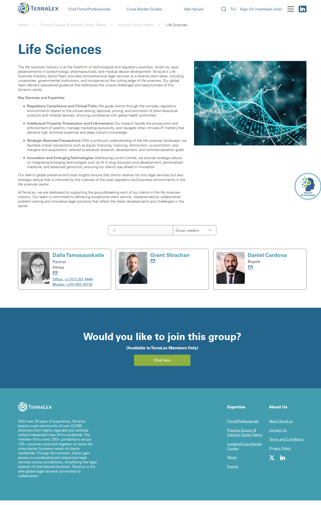

# Industry Sector Team detail (templated)

**Live URL (representative):** https://www.terralex.org/practice-groups-Industry-sector-teams/industry-sector-teams/ist-life-sciences
**Local file (target):** new file: `industry-sector-team-detail.html`
**Page purpose:** Templated detail page for a single TerraLex Industry Sector Team (e.g. Life Sciences) — presenting an industry overview, scope of expertise, group leaders, member firms by region, and a route to engage the team.

**Live screenshot:** [../screenshots/13-industry-sector-team-detail.png](../screenshots/13-industry-sector-team-detail.png)

> **Template-sharing note:** This page can share **most** of its layout/structure with `practice-group-detail.html` — the only meaningful content differences are the taxonomy label ("Industry Sector Team" vs. "Practice Group"), the breadcrumb segment, and the related-rail target. Strongly recommend a **single shared template** (`group-detail.html`) parameterised by a small `groupType` flag, with content driven from a static JS data stub. Flag this in the implementation: build one component, render two URLs.

## Current state — observations
- Top-to-bottom flow: site header (logo, search, primary nav, Member Sign-on, Expertise mega-dropdown) → breadcrumb (Home > Practice Groups & Industry Sector Teams > Industry Sector Teams > Life Sciences) → H2 page title "Life Sciences" → introductory paragraph → "Key Services and Expertise" bullet list (4 items) → "Group Leaders" cards (3 people) → "Would you like to join this group?" members-only CTA → cookie banner → standard footer.
- Hero is a plain text H2 with no image, no industry icon, no kicker, no member-count or jurisdiction-coverage metric.
- Overview is a single short paragraph: *"The life sciences industry is at the forefront of technological and regulatory evolution, driven by rapid advancements in biotechnology, pharmaceuticals, and medical device development."* Tone is professional, authoritative, forward-looking; emphasises "global team" and "specialized guidance".
- Key Services rendered as a flat 4-item bullet list (Regulatory Compliance and Clinical Trials; Intellectual Property Prosecution and Enforcement; Strategic Business Transactions; Innovation and Emerging Technologies) — no icons, no descriptions, no links.
- Group Leaders block: three cards with profile photo, name, title (Partner), location (e.g. Vilnius, Bogotá), office phone, mobile phone, obfuscated email. Leaders shown: Dalia Tamasauskaite, Grant Strachan, Daniel Cardona.
- **No member-firm listing on the page** — neither flat nor regionally grouped. Firms participating in this Industry Sector Team are not surfaced anywhere on the detail page.
- No related Industry Sector Teams rail, no related Practice Groups cross-link, no map of coverage, no statistics strip (firm count / jurisdictions / lawyers), no filters, no tabs, no accordion, no anchor nav.
- "Would you like to join this group?" is a members-only CTA — public/prospect users hit a dead-end with no public conversion path.
- Visual hierarchy: H2 title, then a sea of H3s (Key Services / Group Leaders) and a closing H2 — shallow, undifferentiated.
- Headings in order: H2 "Life Sciences" → H3 "Key Services and Expertise" → H3 "Group Leaders" → H2 "Would you like to join this group?".

## What works (Pros)
- Breadcrumb (Home > Practice Groups & Industry Sector Teams > Industry Sector Teams > Life Sciences) is clear and SEO-friendly — preserve.
- Group Leaders card pattern (photo + name + title + location + email) is the strongest element on the page — keep and elevate.
- Tight, authoritative copy tone matches the audience (in-house counsel, GCs) — preserve voice.
- Short overview paragraph is scannable — preserve brevity, add visual structure around it.

## What doesn't work (Cons)
- **No member-firm listing at all** — the headline value of TerraLex (curated firm network across 200+ jurisdictions) is invisible on the team page that should showcase it. [UX][Content]
- Hero is a flat H2 with no industry visual, icon, or coverage metric — indistinguishable from a generic article. [UI]
- Key Services bullet list is unstructured: no icons, no one-line descriptions, no link-out to deeper detail. [UX][Content]
- Group Leaders cards mix obfuscated email with raw phone numbers — inconsistent privacy treatment, and no LinkedIn or "request introduction" CTA. [UX][Content]
- No coverage map / regional footprint — users cannot see where in the world this team operates. [UI][Content]
- No related Industry Sector Teams rail and no cross-link to overlapping Practice Groups (e.g. Healthcare PG ↔ Life Sciences IST). [UX]
- The closing CTA is members-only — public users get no conversion path ("Request expertise", "Contact a leader"). [UX][Content]
- Heading hierarchy mixes H2/H3 inconsistently (closing CTA is H2) — confusing for screen readers. [Accessibility]
- No anchor nav / on-page TOC — short page today, but the redesign will add sections that need it. [UX][Accessibility]
- Mobile: leader cards likely stack acceptably but the page lacks any thumb-reachable primary CTA above the fold. [Mobile]
- No quick-stats strip (member firms / jurisdictions / lawyers in this practice) — wasted credibility moment. [Content]
- Cookie banner overlaps content on first load with no "Manage" affordance visible — ambient annoyance. [UX]

## Redesign plan
- **Direction:** turn the IST detail page from a thin text stub into a **credible practice landing page** — a confident hero with industry name + coverage metric, a structured services grid, prominent group-leader cards, and (the missing piece) a **member-firm directory grouped by region** with a coverage map.
- **Visual language alignment with `index.html`:** reuse the navy-on-cream palette via `css/tokens.css`, the `Source Sans 3` + `DM Sans` stack, the `ds-display` / `ds-thin` / `ds-body-lg` heading system, and the `ds-btn ds-btn-primary` / `ds-btn-ghost` button system from `css/design-system.css`.
- **Component reuse from `index.html`:** lift `<header class="site-header">` and the footer; reuse the Section 4 card system for leader cards and member-firm cards; reuse the Section 6 stat-strip pattern for the coverage metrics; reuse the News & Insights tag-chip styling for service tags; echo the homepage globe motif at small scale for the coverage map.
- **Hero treatment:** navy band with `ds-thin` kicker ("Industry Sector Team"), industry name in `ds-display` ("Life Sciences"), short blurb beneath, and a quick-stats horizontal strip (Member firms · Jurisdictions · Group leaders). Primary CTA "Request introduction" + secondary "Email group leaders".
- **Key Services & Expertise:** 2x2 grid of icon + title + one-line description tiles, each linking (where relevant) to the matching Cross-Border Guide or Practice Group hub.
- **Group Leaders:** elevated card row (photo, name, title, firm + city, email, LinkedIn) — direct contact, not buried.
- **Member firms by region:** the **central new section**. Region tabs or section blocks (Europe, Americas, Asia-Pacific, Middle East & Africa) with a card per firm: firm logo, name, city, "View firm →" link to `firm.html`. Static JSON stub for the prototype.
- **Coverage map:** small static globe / dotted-world image with markers for participating jurisdictions — can reuse the homepage globe-canvas at reduced scale, frozen.
- **Related Industry Sector Teams:** three-card horizontal rail at the bottom (e.g. Healthcare, Technology, Energy) reusing the firm-card / news-card component.
- **Closing CTA band:** "Need life sciences counsel across borders?" with `ds-btn-primary` "Request an introduction" + `ds-btn-ghost` "Browse all Industry Sector Teams".

## Instructions for Claude Code (implementation brief)
1. **Target file:** create `industry-sector-team-detail.html` as a fresh templated page. **Strongly preferred:** build one shared `group-detail.html` template parameterised by a `groupType` flag (`"ist"` | `"pg"`) and render this URL plus `practice-group-detail.html` from the same component — only the kicker label, breadcrumb segment, related-rail data source, and CTA copy differ. If a single shared template is taken, leave `industry-sector-team-detail.html` as a thin wrapper that passes `groupType: "ist"`.
2. **Reuse, do not duplicate:** lift `<header class="site-header">` and footer from `index.html`; load the same stylesheet chain (`css/tokens.css`, `css/base.css`, `css/header.css`, `css/sections.css`, `css/design-system.css`, `css/responsive.css`); use `ds-display`, `ds-thin`, `ds-body-lg`, `ds-btn`, `ds-btn-primary`, `ds-btn-ghost`, `on-dark`; reuse the card, chip, and stat-strip patterns from `index.html` Sections 4–6; reuse the existing Source Sans 3 / DM Sans font links.
3. **Sections to build, in order:**
   1. Site header (lifted from `index.html`).
   2. Breadcrumb row (Home > Practice Groups & Industry Sector Teams > Industry Sector Teams > [Team name]) — sticky just below header on scroll.
   3. Hero band — `ds-thin` kicker "Industry Sector Team", `ds-display` team name, blurb, quick-stats strip (Member firms · Jurisdictions · Group leaders), primary + secondary CTAs.
   4. Key Services & Expertise — 2x2 (or 2x3) icon-title-description tile grid.
   5. Group Leaders — 3–4 leader cards (photo, name, title, firm + city, email, LinkedIn).
   6. Member firms by region — region tabs or stacked region blocks (Europe, Americas, Asia-Pacific, MEA), each containing a responsive grid of firm cards (logo, name, city, "View firm →" → `firm.html`). Static JSON stub.
   7. Coverage map — small frozen globe / world map illustration with jurisdiction markers (front-end only; can reuse homepage globe canvas at reduced scale or a static SVG).
   8. Related Industry Sector Teams — three-card horizontal rail with link "View all Industry Sector Teams".
   9. Closing CTA band — "Need [industry] counsel across borders?" with `ds-btn-primary` "Request an introduction" + `ds-btn-ghost` "Browse all Industry Sector Teams".
   10. Site footer (lifted from `index.html`).
4. **Backend constraint:** front-end only. Do not propose new APIs, data-schema changes, search re-indexing, auth flows, or any terralex.org server-side work. Group leader photos, member-firm rosters, region groupings, coverage-map markers, and related-team rails are populated from a static JS stub (`groupData.js` or inline `<script>`) — no live data binding. Locally serve via `npx serve . -l 8080`.
5. **Acceptance criteria:** visual fidelity to the homepage language (navy + cream, `ds-display` typography, card system); responsive at the project's existing breakpoints (mobile ≤ 720, tablet 721–1024, desktop ≥ 1025); zero console errors when served via `npx serve . -l 8080`; breadcrumb, region tabs, leader CTAs, and related-rail keyboard-reachable; if implemented as the shared `group-detail.html`, switching `groupType` between `"ist"` and `"pg"` swaps kicker/breadcrumb/related-rail correctly without layout regression.
