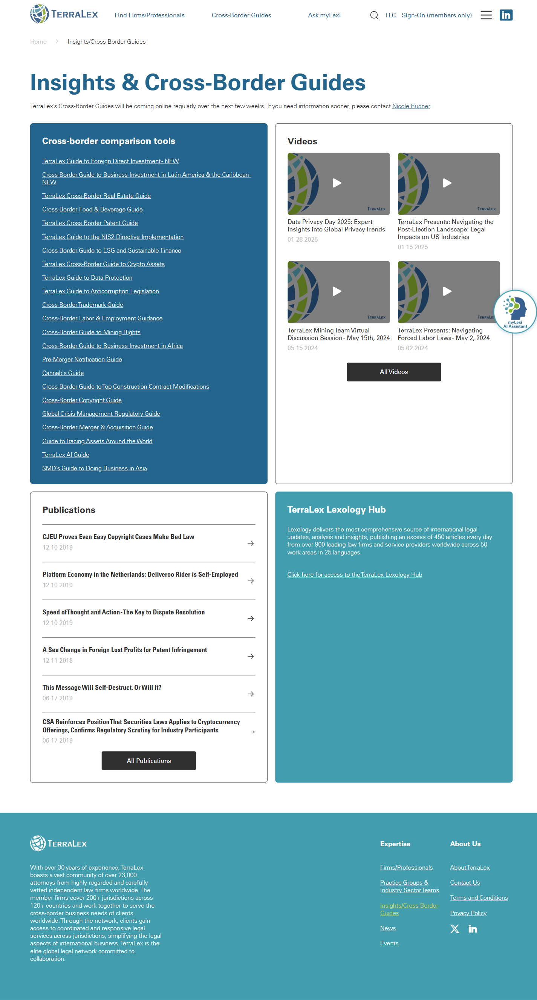

# Insights & Cross-Border Guides

**Live URL:** https://www.terralex.org/insights-cross-border-guides
**Local file (target):** new file: insights-cross-border-guides.html
**Page purpose:** Hub for TerraLex's library of cross-border comparison guides spanning practice areas (FDI, Real Estate, ESG, IP, AI, Labor, etc.) plus related videos and publications.

**Live screenshot:** [../screenshots/04-insights-cross-border-guides.png](../screenshots/04-insights-cross-border-guides.png)

## Current state — observations
- Standard masthead + main menu + search; no hero image, no eyebrow, no editorial framing — the page drops straight into a small intro paragraph ("TerraLex's Cross-Border Guides will be coming online regularly...") with a contact-Nicole-Rudner referral.
- Primary content is a single H2 ("Cross-border comparison tools") followed by an unordered list of ~23 inline text hyperlinks. No imagery, no descriptions, no jurisdiction count, no "last updated" stamp, no preview.
- Practice areas covered span FDI, Real Estate, Food & Beverage, Patents, Trademarks, Copyrights, Cybersecurity (NIS2), ESG / sustainable finance, Cryptocurrency, Data Protection, Anticorruption, Labor & Employment, Mining, M&A, Construction, Cannabis, AI — but they are mixed flat in one alphabetical-ish list with no grouping by category.
- Below the list: a "Videos" block (4 webinar thumbnails, dates back to Jan 2025) and a "Publications" block (6 archived articles, oldest 2018). These appear as basic thumbs/links with minimal styling.
- No filter controls, no search-within-guides, no tag chips, no pagination, no sort, no "featured guide" hero.
- Tone is operational/admin ("coming online regularly"), not authoritative or marketing-grade. CTAs reduce to a single mailto-style contact link.

## What works (Pros)
- Lightweight and fast — no heavy media payload.
- Clear single intent: "here are our guides, click one." Zero distraction.
- Breadth of practice-area coverage is genuinely impressive once the user reads the list.
- Videos + Publications provide useful adjacent content in one place.

## What doesn't work (Cons)
- [UI] Plain bulleted text-link list undersells what is arguably TerraLex's most valuable content asset; visually it looks like a sitemap dump, not a flagship product.
- [UI] No imagery, iconography, or color cues per practice area — every guide looks identical, scannability is poor.
- [UX] No filtering, search, or category grouping for 23+ guides; user must read every line to find one.
- [UX] No metadata visible per guide (jurisdictions covered, last-updated date, author firm, page count) so the user cannot judge quality or freshness before clicking.
- [Content] Intro copy is apologetic ("will be coming online regularly") rather than confident; no value framing of why these guides matter.
- [Content] No featured / latest / most-popular guide treatment.
- [Accessibility] Long unstructured link list with no headings between groups — screen-reader users get a flat soup; link text is sometimes the practice-area name only with no context.
- [Mobile] Likely fine because content is text, but the lack of visual hierarchy makes it equally bland on phone.
- [UX] Videos and Publications sections are tacked on with no clear divider, eyebrow label, or "see all" affordance.
- [UI] No consistent visual language with the new index.html (no on-dark hero, no card system, no eyebrow/bold/thin headline pattern).

## Redesign plan
- Lead with a confident dark hero reusing the `s8-hero` pattern from `index.html`: eyebrow "Cross-Border Intelligence", split-weight headline ("Cross-Border Guides" thin / "Compare Regulation Across Jurisdictions" bold), and a one-line value proposition. Add a stat strip ("23 guides · 40+ jurisdictions · Updated 2025").
- Replace the bullet list with a card grid built on the existing `s8-guide-card` component (image background, "Guide NN" eyebrow, title, short description, Preview link). All 23 guides become cards.
- Add a category filter row (chips: All · Corporate / M&A · Investment & FDI · IP · Tech & Data · ESG · Real Estate · Labor · Sector — Food, Mining, Cannabis, Hospitality). Pure front-end JS filter on a `data-category` attribute.
- Add a search-within field (client-side fuzzy filter against title + description + tags).
- Add an optional sort toggle (A–Z / Newest) — front-end only, no backend.
- Featured guide module at top of the grid: large 2x card highlighting one current guide (e.g. AI or NIS2) with a longer summary.
- Videos block redesigned with the `s3b-news`-style card track (image + tag chips + title) for visual parity.
- Publications block redesigned as a clean dated list with year separators and tag chips.
- Closing CTA reusing the `s9-cta` band: "Need a jurisdiction we don't list? Talk to a member firm" → contact.

## Instructions for Claude Code (implementation brief)
1. Target file: `insights-cross-border-guides.html` — new file in project root, mirroring the structure and head/script wiring of `index.html`.
2. Reuse from `index.html`:
   - `<header class="site-header">` (lines ~97+) verbatim, with active-state on the Insights menu item.
   - `<footer class="site-footer">` (lines ~843+) verbatim.
   - `s8-hero` pattern (lines 626–638) for the page hero — swap the headline/eyebrow copy, keep the dark image + overlay treatment.
   - `s8-guide-card` markup (lines 642–648) repeated for every guide in the grid; replace the `s8-guides-track` flex/snap layout with a CSS-grid container (`grid-template-columns: repeat(auto-fill, minmax(320px, 1fr))`) so it behaves as a hub grid rather than a horizontal track.
   - `s3b-news` card pattern (lines 336–345) for the Videos row.
   - `ds-btn ds-btn-primary`, `ds-eyebrow`, `ds-h1`, `ds-thin`, `ds-bold`, `ds-h3`, `ds-body-sm`, `on-dark`, `ds-accent` design-system classes throughout.
   - `s9-cta` band for the closing contact CTA.
3. Sections to build, in order:
   1. Site header (reused).
   2. Hero — dark, eyebrow + split-weight headline + 1-line subhead + stat strip (3 inline stats).
   3. Sticky filter bar — category chips + search input + sort select. Pure front-end, filters cards via `data-category` and `data-tags` attributes.
   4. Featured guide — full-width 2-col card (image left, copy right) for the editor's pick.
   5. Guide grid — all 23 guides as `s8-guide-card`s in a responsive grid. Each card carries: image, "Guide NN" eyebrow, title, 1-line description, jurisdiction-count chip, "Updated YYYY" stamp, Preview link. Reuse existing `assets/images/guides/CBG-to-*.jpg` art; use placeholder/duplicate art for guides without bespoke imagery.
   6. Videos — 4-card track using `s3b-news` styling, tags + date overlay.
   7. Publications — dated list grouped by year, with tag chips.
   8. Closing CTA band — `s9-cta` reused.
   9. Site footer (reused).
4. **Backend constraint:** do not propose features that require terralex.org backend changes. All filtering, searching, sorting, and tagging must run client-side against a static array embedded in the HTML/JS. No CMS, no API. Local prototype = static HTML/CSS/JS only.
5. Acceptance criteria:
   - Page is fully responsive at 360 / 768 / 1024 / 1440 widths; grid collapses cleanly to 1-col on mobile.
   - Filter chips, search input, and sort all operate without page reload and produce no console errors when served via `npx serve . -l 8080`.
   - Visual language matches `index.html` (typography scale, color tokens, hero treatment, card hover states).
   - Header active-state correctly highlights the Insights nav item; all internal anchor links resolve.
   - No external dependencies beyond what `index.html` already loads.
