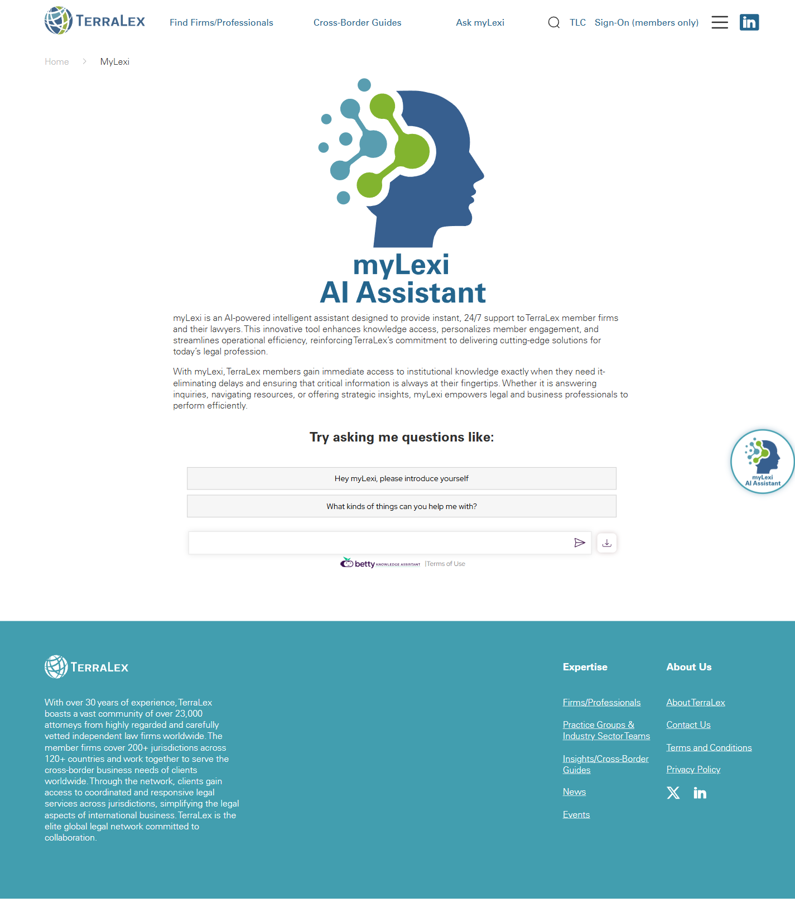

# MyLexi

**Live URL:** https://www.terralex.org/mylexi
**Local file (target):** mylexi.html (fresh redesign)
**Page purpose:** Product/marketing page for myLexi — TerraLex's AI assistant for member firms — that converts visiting lawyers into active users by showing what it does, how it answers, and where to start a conversation.

**Live screenshot:** [../screenshots/06-mylexi.png](../screenshots/06-mylexi.png)

## Current state — observations
- **Hero is barely a hero.** Page leads with the myLexi logo and a single sentence: *"myLexi is an AI-powered intelligent assistant designed to provide instant, 24/7 support to TerraLex member firms and their lawyers."* No headline, no subhead beyond that, no demo image, no primary CTA on the page itself — only the global header carries an "Ask myLexi" link.
- **Value proposition is one paragraph.** Frames the product as a time-saver for "immediate access to institutional knowledge" that "empowers legal and business professionals to perform efficiently." Generic, no differentiation, no examples.
- **Feature block is a single sentence.** Lists three capabilities — *answering inquiries, navigating resources, offering strategic insights* — without separating them into individual feature cards, icons, or example prompts.
- **No demo elements at all.** No screenshot of the chat UI, no animated chat-bubble mockup, no example Q&A, no video, no live demo iframe. Visitor cannot see what the product looks like or what kind of question to ask.
- **No social proof.** Zero testimonials, zero firm logos, zero usage stats ("X questions answered", "Y firms onboarded"), no quotes from member-firm partners.
- **No CTAs on the page body.** Conversion paths exist only via the global header ("Ask myLexi") and footer; the page itself does not invite the visitor to start a chat, request access, or watch a demo.
- **No FAQ, no security/privacy reassurance, no language list.** The product supports 100+ languages (per `index.html` Section 7 copy) and handles confidential legal questions — neither is surfaced here.
- **Layout density is extremely low.** Page is essentially logo + paragraph + whitespace. Reads as a placeholder, not a product page.
- **Copy tone:** corporate-professional, slightly stiff ("cutting-edge solutions", "empowers"). No warmth, no voice that matches an AI assistant.
- **Mobile:** inherits the global header/hamburger; nothing page-specific to evaluate because there's almost no content.

## What works (Pros)
- **Clear, simple positioning sentence** — the one-liner is usable as a hero subhead almost verbatim.
- **myLexi has a strong product mark** — distinct logo + "Ask myLexi" verb-based CTA already established in the global nav and the floating chat widget on `index.html`.
- **Multilingual support (100+ languages)** is a genuine differentiator for a global network — already drafted in `index.html` Section 7 copy and ready to be promoted on the dedicated page.
- **Live chat widget already exists in the codebase** (`css/chat-widget.css`, `assets/logos/mylexi-logo.svg`, `chat-pill` / `chat-panel` markup in `index.html`) — can be reused as the in-page demo without any new backend.

## What doesn't work (Cons)
- **No hero visual or product imagery** [UI][Content] — visitor has no idea what myLexi looks like; the chat-bubble preview from `index.html` Section 7 (`assets/images/misc/mylexi-preview.png`) is missing on the dedicated page.
- **No primary CTA on the page** [UX] — the dedicated landing page for the product does not have an "Ask myLexi" / "Start a chat" button. Conversion is forced back to the global header.
- **Single-paragraph feature description** [Content] — fails to explain what myLexi actually does, what kinds of questions it answers, or what it won't answer.
- **No example prompts** [UX][Content] — legal users need to be told the shape of a good question ("Find a corporate M&A specialist in São Paulo", "Summarize TerraLex's Brazil cross-border guide", "Who at member firm X handles fintech disputes?").
- **No demo, video, or animated mockup** [UI] — for an AI product in 2026 this is below table-stakes.
- **No trust/privacy section** [Content][UX] — lawyers will not adopt an AI that doesn't explain data handling, confidentiality, training-data policy, and member-firm-only access.
- **No social proof / firm adoption story** [Content] — no testimonials, no "used daily by N firms", no quotes from member partners.
- **No FAQ** [Content] — lawyers always have the same five questions about an AI tool (How does it know our network? Is my prompt confidential? What languages? How current is the data? How do I access it?). Page answers none.
- **Low information density / page reads as placeholder** [UI] — does not earn the click from the global nav.
- **Mobile experience inherits emptiness** [Mobile] — there is essentially nothing to compress because there is essentially nothing on the page.
- **No accessibility considerations on the chat affordance** [Accessibility] — without a visible CTA on the page, screen-reader users have no in-page entry point.

## Redesign plan
- **Direction — bold product hero, feature cards, in-page chat demo, trust band, CTA.** Treat myLexi as a flagship product launch page, not a feature footnote. Use the same dark-hero / on-dark display-typography language as `index.html` Slide 1, with the chat-bubble preview asset (or a richer interactive variant) as the hero visual.
- **Component reuse from `index.html`:** site-header (with white-on-hero logo state), site-footer, `ds-h1` / `ds-thin` / `ds-bold` / `ds-accent` typography tokens, `ds-body-lg` body copy, `s3-numbers` stat tile pattern (for trust stats), `s3b-news` card grid (for example-prompt cards), `s9-cta` final-CTA band, and the existing `chat-widget` (`#chatWidget` / `chat-pill` / `chat-panel`) which can be auto-opened in the demo section. Hero image asset already exists: `assets/images/misc/mylexi-preview.png`.

## Instructions for Claude Code (implementation brief)
1. Target file: `mylexi.html` — fresh rewrite (existing file discarded).
2. Reuse: header, footer, typography (`ds-*` tokens), card system, count-up stat tiles, and final CTA band from `index.html`. Note that `index.html` Section 7 already has a myLexi preview image (`assets/images/misc/mylexi-preview.png`) and a working chat widget (`css/chat-widget.css`, `mylexi-logo.svg`) — leverage both as starting points; the chat widget should appear on this page and ideally auto-prompt in the in-page demo section.
3. Sections to build, in order:
   1. **Hero** — dark/full-bleed background, eyebrow ("AI Assistant"), `ds-thin` + `ds-bold` two-line display headline ("Immediate access to network knowledge / Through myLexi."), `ds-body-lg` 1-line subhead reusing the live page sentence + "in 100+ languages", primary CTA ("Ask myLexi") + ghost CTA ("See how it works" → scrolls to demo). Right column: `mylexi-preview.png` chat-bubble visual with subtle float / parallax.
   2. **Trust strip / numbers** — 4 count-up tiles reusing `s3-numbers` pattern: 100+ languages, 24/7 availability, 141 member firms covered, 207 jurisdictions indexed.
   3. **What myLexi does** — 3 feature cards (Answer inquiries / Navigate the network / Strategic insights) each with icon, 1-line title, 2-line description, example prompt chip.
   4. **Live demo** — embedded chat panel (reuse `chat-widget` markup, expanded inline), with 4 clickable example prompts that pre-fill the input ("Find an M&A partner in São Paulo", "Summarize the Brazil cross-border guide", "Which firms cover fintech disputes in APAC?", "Draft an intro to the Qatar member firm"). Pure front-end: prompts render canned myLexi responses from a static JSON, no real API call.
   5. **Example prompt gallery** — 6-card grid (`s3b-news`-style) of richer use cases by role (Partner, Associate, Marketing, BD, Knowledge Mgmt, Client-facing).
   6. **Trust & confidentiality** — 3-column band: Member-firm-only access, Confidential by design, Always current (synced with TerraLex directory + cross-border guides). Static copy only.
   7. **FAQ** — accordion with 5 questions: What is myLexi? / Who can use it? / What languages? / How is my data handled? / How do I get access? Static answers.
   8. **Final CTA band** — reuse `s9-cta` pattern with quote-style headline ("Your network, one question away.") + primary "Ask myLexi" + secondary "Talk to TerraLex".
   9. **Footer** — reuse `site-footer` from `index.html`.
4. **Backend constraint:** do not propose features that require terralex.org backend changes. The "live demo" must be a static front-end simulation (canned responses from local JSON); no new AI APIs, no auth flow, no real chat backend. Local prototype = static HTML/CSS/JS.
5. Acceptance criteria: responsive (1440 / 1024 / 768 / 375), no console errors, hero passes WCAG AA contrast on dark background, chat-widget pill remains globally available, page works via `npx serve . -l 8080`.
