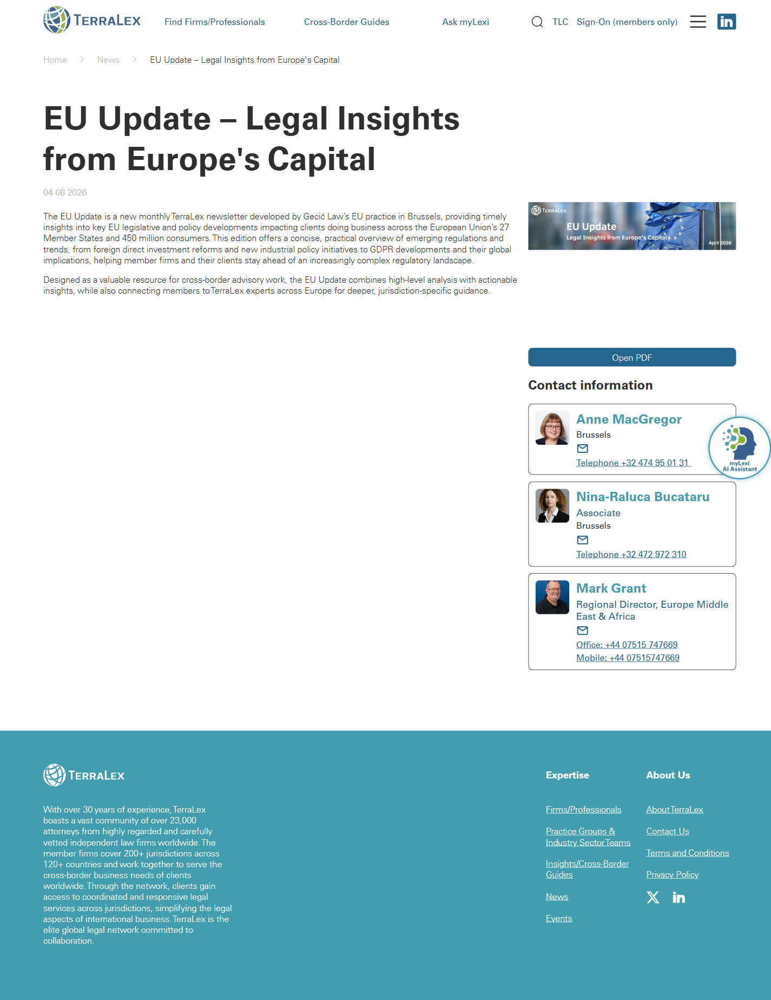

# News article (template)

**Live URL (representative):** https://www.terralex.org/news/eu-update-legal-insights-from-europes-capital
**Local file (target):** new file: news-article.html
**Page purpose:** Templated long-form article page for a single TerraLex news / insight item, optimized for readability and onward discovery into related content.

**Live screenshot:** [../screenshots/08-news-article.png](../screenshots/08-news-article.png)

## Current state — observations
- Hero is a stacked title + publication date (`04.08.2026`) + a single full-width cover image. No author byline at the top; no eyebrow/category, no read-time, no tags.
- Breadcrumb: `Home > News`, sitting above the title — minimal, easy to miss.
- Body is short (two paragraphs of intro copy explaining the newsletter purpose) using the same conservative sans-serif as the rest of the site; line length is wide (close to full content column), no pull-quotes, no in-body subheads, no figure captions.
- Author / contact block sits **at the bottom** as three contact cards (Anne MacGregor, Nina-Raluca Bucataru, Mark Grant) with portrait, role, office, obfuscated email, phone. This is effectively the byline — but inverted to the foot of the article.
- No share / social buttons, no copy-link, no print, no LinkedIn share — surprising for a B2B legal-network publication whose audience lives on LinkedIn.
- No related articles, no "more from this author", no tags, no category chips, no "next / previous in News" pager, no back-to-listing CTA at the foot.
- Sidebar: none. Single-column layout, full site header + global footer wrap the article.
- Density is light (lots of whitespace), but readability suffers because the column is too wide and there is no hierarchy inside the body.
- Mobile: page inherits the legacy responsive grid; contact cards likely stack but were not directly observed.

## What works (Pros)
- **Single-column, distraction-free body** — no aggressive sidebar ads or popovers, the reader can focus on the text.
- **Cover image** establishes topic at a glance (EU flags / parliament for the EU Update piece).
- **Breadcrumb is present**, giving back-out to /news listing.
- **Author contact cards** at the foot are genuinely useful for a legal audience that wants to reach the lawyer directly — better than a name-only byline.

## What doesn't work (Cons)
- **No top byline** [UX][Content] — reader can't tell who wrote it without scrolling to the end. For a credibility-driven legal publication this is the wrong default.
- **Date format `04.08.2026` is ambiguous** [Content][Accessibility] — DD.MM vs MM.DD is locale-dependent; should be spelled-out (`08 April 2026`).
- **No share buttons (esp. LinkedIn / Copy link)** [UX] — kills the most common distribution path for legal thought leadership.
- **No related / next-up articles** [UX][Content] — dead-end page; reader either bounces or has to navigate back to /news manually.
- **No tags / category chips** [Content] — can't pivot to "more EU regulatory" or "more from Brussels office".
- **No estimated read time, no eyebrow category** [UX] — first-impression scannability is weak.
- **Body column is too wide for comfortable reading** [UI][Accessibility] — should cap around 65–75ch.
- **Headings inside body are flat / not styled** [UI] — long pieces in this template would have no visible H2/H3 rhythm.
- **No pull-quote or figure styling** [UI] — limits the editorial feel; the page reads like a memo, not a publication.
- **No print stylesheet, no jump-to-top, no progress bar on long reads** [UX].
- **Email obfuscation in contact cards is clumsy** [UX] — visible text reads as masked rather than as a real `mailto:` affordance.
- **Mobile behavior unverified** [Mobile] — needs explicit single-column body, sticky lightweight header, collapsible related rail.

## Redesign plan
- **Direction:** treat this as a long-form editorial template, not a press release. Magazine-grade typography, top byline + bottom contact cards, share rail, related stories — all front-end only.
- **Hero** — full-bleed cover image with a dark gradient scrim; eyebrow category (e.g. "EU Regulatory") in `ds-eyebrow`, headline in `ds-display` / `ds-thin`+`ds-bold` weight contrast (reuse from `index.html` slide 1), publication date spelled out + estimated read time + author chip (portrait + name → links to firm page).
- **Breadcrumb** above hero in the existing header band: `Home / News & Insights / EU Update — Legal Insights from Europe's Capital`.
- **Body container** capped at ~70ch, `ds-body-lg` for lead paragraph, regular body for rest, real H2/H3 rhythm, blockquote / pull-quote styling, figure + caption styling, in-body link underline.
- **Floating share rail** (LinkedIn, X, Copy link, Email) — sticky on the left at desktop, collapses to a horizontal strip below the hero on mobile.
- **Author / contact block** at the foot — reuse the existing 3-card portrait pattern but visually unify with the directory card style from `.s2-directory`.
- **Tags / topics row** below the body, before related articles.
- **Related articles** — reuse the `.s3b-news` 4-card grid from `index.html` (overlay tag + title + image), filtered to "More News & Insights".
- **Footer CTA band** — reuse `.s9-cta` shape with a quieter prompt ("Subscribe to TerraLex News" or "Browse all News & Insights").
- **Component reuse from `index.html` / `css/`:** `.site-header` + `.nav-topbar` + `.nav-mega`, `.s3b-news` cards, `.s9-cta`, `.site-footer`, design tokens (`ds-display`, `ds-h1`, `ds-h2`, `ds-eyebrow`, `ds-body-lg`, `ds-thin`, `ds-bold`, `ds-accent`, `ds-btn-primary`, `ds-btn-ghost`, `on-dark`).

## Instructions for Claude Code (implementation brief)
1. **Target file:** `news-article.html` — new file at repo root, mirroring the structure of `index.html`'s `<head>` (same font links, same `css/design-system.css` + `css/responsive.css` includes) and the same global header / footer markup so navigation parity holds.
2. **Reuse:** header (`.site-header`, `.nav-topbar`, `.nav-mega`, mobile drawer), footer (`.site-footer`), typography classes, button classes, and the `.s3b-news` related-cards grid from `index.html`. Do **not** reinvent these — copy markup, lift class names.
3. **Sections to build, in order:**
   1. Global header (reused).
   2. Breadcrumb strip — `Home / News & Insights / <article title>`.
   3. Article hero — eyebrow category, `<h1>` headline, dateline (spelled-out date · read time · author chip), full-bleed cover image with gradient scrim.
   4. Body container — capped reading column, lead paragraph, body paragraphs, H2/H3 sample, blockquote sample, figure + caption sample, inline link sample.
   5. Floating share rail — LinkedIn, X, Copy link (uses `navigator.clipboard`), Email (`mailto:`); sticky-left desktop, horizontal strip mobile.
   6. Tags row — chip list of topics.
   7. Author / contact block — 3 portrait cards (name, role, office, `mailto:` link, phone).
   8. Related articles — `.s3b-news`-style 4-card grid, hard-coded with 4 sibling stories from `index.html`'s News & Insights section.
   9. CTA band — "Browse all News & Insights" reusing `.s9-cta` shell.
   10. Global footer (reused).
4. **Backend constraint:** do not propose features that require terralex.org backend changes (no CMS hookup, no real comments, no auth-gated content, no analytics endpoints). The page is a static templated prototype — content is hard-coded HTML, share buttons use client-side `navigator.clipboard` and standard intent URLs, related cards are static. Front-end-only re-skin.
5. **Acceptance criteria:**
   - Renders without console errors when served via `npx serve . -l 8080` and opened at `http://localhost:8080/news-article.html`.
   - Header / footer match `index.html` 1:1 (same scrolled-state behavior, same mega-menu).
   - Body column caps at ~70ch and stays readable from 320px up to 1440px+.
   - Share rail is sticky on desktop, collapses under hero on mobile (≤768px).
   - Related-cards grid reflows 4 → 2 → 1 column at the same breakpoints as `.s3b-news` in `index.html`.
   - All images have `alt` text; headings form a valid `h1 → h2 → h3` outline; date is wrapped in `<time datetime="…">`.
   - No layout shift on cover-image load (set `width`/`height` or `aspect-ratio`).
