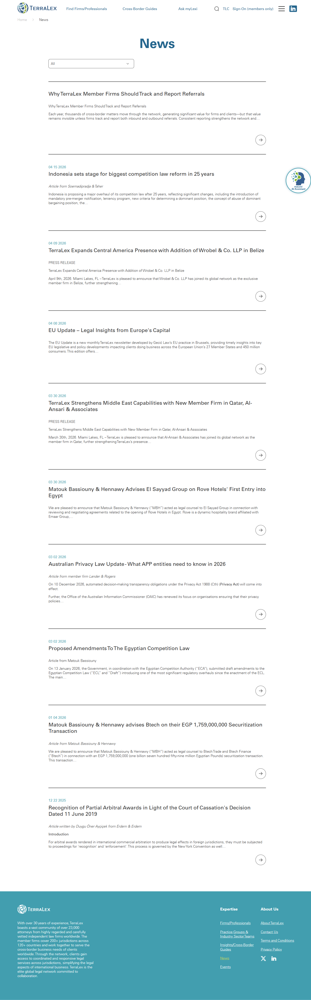

# News

**Live URL:** https://www.terralex.org/news
**Local file (target):** new file: news.html
**Page purpose:** News index — a chronological feed of TerraLex network articles, member-firm announcements, EU/regional updates, and insights, with category filtering.

**Live screenshot:** [../screenshots/07-news.png](../screenshots/07-news.png)

## Current state — observations
- No hero or banner — page jumps straight from the global header into the news feed under a thin section heading; very minimal vertical hierarchy.
- Article list is JavaScript-rendered: static HTML ships only "Loading..." placeholders and an "All" filter chip, so the page is blank until the script hydrates (the index appears empty on slow connections / when JS is disabled).
- Once hydrated, the layout reads as a flat uniform grid of article cards (no featured/large lead story); a single "All" category pill is visible — implies a category filter exists but the only category surfaced is the catch-all.
- No visible pagination, load-more, or infinite scroll affordances in the static markup; no sidebar, no search, no date scrubber.
- Card composition is generic: thumbnail + headline + (likely) date/category — no excerpt-led storytelling, no author byline, no read-time.
- Imagery is inconsistent across the wider site (mix of stock skylines, EU flags, regional shots) — `index.html` Section 3B already standardises 4 strong story-matched images (terralex-alb, eu-update, Belize, Qatar) that should set the bar.
- Copy tone is corporate-formal ("elite global legal network", "23,000 attorneys"); headlines on the home page News teaser are long and descriptive (60–100 chars).
- Footer is the standard TerraLex "Expertise / About Us / social" block plus a persistent cookie banner.
- Mobile: responsive header is present; the rendered grid behaviour on mobile is not verifiable from the static snapshot, but the pattern (uniform cards, no filter UI density) should collapse cleanly to a single column.

## What works (Pros)
- Clean, uncluttered chrome — header + footer don't fight the content.
- Filter affordance exists ("All" chip) — extension point for category navigation.
- Card-led layout is the right primitive for a news index.
- The home-page News & Insights section (`s3b-news` in `index.html`) already defines a good visual card pattern: image with overlay, dual tag pills, large white headline on dark gradient — directly promotable.

## What doesn't work (Cons)
- [UX] No featured/lead story — all articles read as equal weight, so the most recent or most important update has no prominence.
- [UX] No visible date, no "read time", no excerpt — users can't triage articles at a glance.
- [UX] No pagination or load-more — feed termination is unclear.
- [UX] Single "All" filter is functionally a dead chip; categories (Insight, EU Update, New Member, Region) are not surfaced as filters even though the home page tags suggest the taxonomy exists.
- [UI] No hero/banner — the page lands cold; no editorial framing of what "News" means at TerraLex (network announcements vs. legal insights vs. events).
- [UI] Static HTML is empty until JS runs — feels broken on first paint and is bad for SEO/share previews.
- [Content] Headlines run long without an excerpt to support them; tone is uniformly formal — no editorial voice differentiation between announcements and analysis.
- [Accessibility] "Loading..." placeholder spam without `aria-busy` / live-region semantics; filter chip likely not a real `<button>` with selected state announced to screen readers.
- [Mobile] Without an excerpt and with long headlines, mobile cards risk becoming tall image+headline blocks with no scannable metadata; filter row needs horizontal scroll treatment.

## Redesign plan
- Direction: editorial **magazine-style index** — a featured lead story up top (large image, eyebrow category, big headline, dek/excerpt, date), then a 3-column responsive card grid below; category chip row sits between the two as sticky-on-scroll filter.
- Visual language reuses Section 3B's image-first card with overlay tags + headline, but the index variant lifts the headline and date *out* of the image (always-readable on light bg) and adds a 1–2 line excerpt.
- Component reuse from `index.html`: global header, footer, `.ds-h1/.ds-h3/.ds-eyebrow` typography, `.ds-btn-primary` for load-more, `.s3b-tag` pills for category chips, `.s3b-card-img` ratio + hover scale.
- Promote Section 3B's 4 cards as the seed content for the local prototype (they already have polished imagery and tags) and add ~8 more synthetic entries to demonstrate grid density and pagination.
- Add a sticky category chip row (All / Insight / EU Update / New Member / Region) — front-end-only filter, hides cards by `data-category` attribute.
- Add a "Load more" button that reveals the next batch of hidden cards (no real pagination needed — pure JS toggle).

## Instructions for Claude Code (implementation brief)
1. Target file: `news.html` — new file at project root, sibling to `index.html`.
2. Reuse: copy the global header markup (logo + nav + member sign-in) and footer block from `index.html` verbatim. Reuse `assets/css` tokens (`ds-h1`, `ds-h3`, `ds-eyebrow`, `ds-btn-primary`, `ds-accent`, `ds-thin`, `ds-bold`). Promote the `s3b-card` / `s3b-card-img` / `s3b-tag` pattern from Section 3B (lines 326–386 of `index.html`) into a reusable `.news-card` class for this page; the 4 existing card images in `assets/images/news/` are the seed content.
3. Sections to build, in order:
   1. Global header (reused from `index.html`).
   2. Page hero — slim banner, eyebrow "Newsroom", `ds-h1` heading "News & **Insights**", one-line dek (e.g. "Updates, member announcements, and legal insight from across the TerraLex network.").
   3. Featured story — full-width 16:9 image left, copy block right (eyebrow category, large headline, 2-line excerpt, date, `ds-btn-primary` "Read story"). Use the Collaborative Law / `terralex-alb.jpg` story as the seed.
   4. Category filter row — horizontally-scrollable chip strip (All / Insight / EU Update / New Member / Events / Regions), sticky under header on scroll.
   5. Article card grid — 3 columns desktop, 2 tablet, 1 mobile. Each card: image (16:9, hover scale), tag pills, headline (`ds-h3`), 1–2 line excerpt, date in muted small caps. ~12 cards total for the prototype.
   6. Load-more button — `ds-btn-primary` centred below grid; pure JS reveals next 6 hidden cards on click; hides itself when none remain.
   7. Footer (reused from `index.html`).
4. **Backend constraint:** do not propose features that require terralex.org backend changes. Filtering, pagination, and search must be front-end-only (client-side `data-category` toggling, hardcoded card list in markup). No CMS, no API, no auth. Local prototype = static HTML/CSS/JS only.
5. Acceptance criteria:
   - Renders correctly via `npx serve . -l 8080` with zero console errors and zero 404s on assets.
   - Responsive at 1440 / 1024 / 768 / 375 widths; grid collapses 3 → 2 → 1.
   - Category chips toggle visible cards; "All" resets; active chip has visible selected state.
   - Load-more reveals hidden cards and disappears when exhausted.
   - Header + footer visually identical to `index.html`.
   - Keyboard-navigable: chips are real `<button>`s, cards are `<a>`s, focus styles inherit from the design system.
