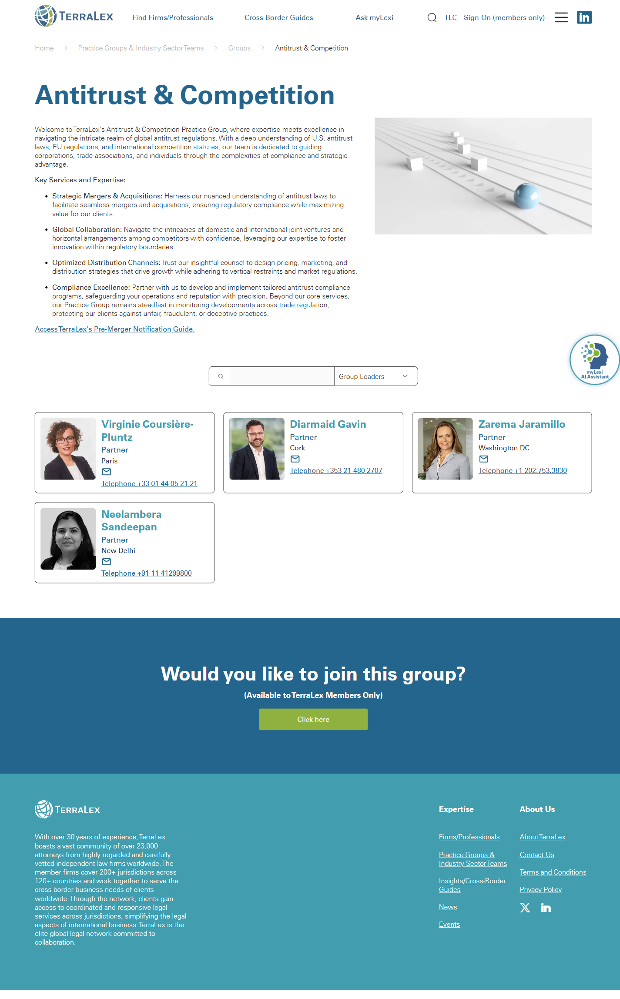

# Practice Group detail (templated)

**Live URL (representative):** https://www.terralex.org/practice-groups-Industry-sector-teams/groups/group-antitrust-competition
**Local file (target):** practice-group-detail.html (new file)
**Page purpose:** Templated detail page for a single practice group — overview, member firms, contacts, scope.

**Live screenshot:** [../screenshots/12-practice-group-detail.png](../screenshots/12-practice-group-detail.png)

## Current state — observations
- Top-to-bottom flow: site header (logo, search, primary nav with Find Firms/Professionals, Cross-Border Guides, Ask myLexi, Member Sign-on; secondary "Find Expertise" mega-dropdown and LinkedIn icon) → breadcrumb (Home > Practice Groups & Industry Sector Teams > Groups > Antitrust & Competition) → H1 "Antitrust & Competition" with a low-resolution SVG hero placeholder labelled with the group name → welcome blurb → "Key Services and Expertise" bulleted list → "Group Leaders" partner cards → membership-gated CTA → footer.
- Welcome copy is a single short paragraph in marketing-brochure tone: "Welcome to TerraLex's Antitrust & Competition Practice Group, where expertise meets excellence in navigating the intricate realm of global antitrust regulations." No scope statement, no jurisdictions covered, no representative matters, no industries served.
- "Key Services and Expertise" is a flat four-item bullet list (Strategic Mergers & Acquisitions, Global Collaboration, Optimized Distribution Channels, Compliance Excellence) — buzzword-led, no descriptions, no icons, no link-outs to guides or matters.
- "Group Leaders" renders four partner cards (Virginie Coursière-Pluntz / Paris, Diarmaid Gavin / Cork, Zarema Jaramillo / Washington DC, Neelambera Sandeepan / New Delhi) with headshot, name, title and phone — no firm name surfaced on the card, no email link, no LinkedIn, no bio, no expand action.
- No member-firm listing of any kind: the page emphasises the network's "200+ jurisdictions across 120+ countries" collectively but never names a single firm in the group, despite the user task being "find a competition lawyer in country X".
- No region filter, no country picker, no map, no count of member firms participating in the group, no expandable regional rosters.
- No "related practice groups" rail, no link-outs to Cross-Border Guides on competition/antitrust, no recent news/insights tagged to the group, no events or webinars tied to the group.
- Bottom CTA "Would you like to join this group?" is membership-gated and points only to an internal form — the public-side reader has no equivalent "engage this group" path (no "Request an introduction", no "Get in touch with the chair").
- Visual hierarchy: a single H1, two flat H2s, a placeholder hero, and a wall of bullet points — the page reads like a CMS template with the data fields half-filled.
- Footer is the standard two-column TerraLex footer (network description, Expertise / About link groups, social).

## What works (Pros)
- Breadcrumb pattern (Home > Practice Groups & Industry Sector Teams > Groups > Group name) is clear and SEO-friendly — preserve and echo.
- Group-leaders-as-cards pattern is the right primitive — keep it, just extend with firm, email, LinkedIn and bio.
- Authoritative voice on the network's scale (200+ jurisdictions, 120+ countries) is a strong proof point — surface it as a stat strip rather than buried in footer copy.
- Membership-gated "join this group" CTA preserves a useful internal-member path — keep it as a secondary action.

## What doesn't work (Cons)
- No member-firm listing — the page fails the primary user task ("find a competition lawyer in jurisdiction X via TerraLex"). [UX][Content]
- Welcome blurb is generic marketing prose with no scope, no jurisdictions covered, no representative matters. [Content]
- Hero is a low-resolution SVG placeholder labelled with the group name — visually undifferentiated from any other group page. [UI]
- Key services rendered as four buzzword bullets ("Optimized Distribution Channels", "Compliance Excellence") with no descriptions, no icons, no link-outs. [Content][UI]
- Leader cards omit firm name, email and LinkedIn — phone-only contact is a friction wall for international users in different time zones. [UX][Content]
- No region filter or map for member firms (because there are no member firms shown at all). [UX]
- No related-practice-groups rail, no related Cross-Border Guides, no related news/insights — wasted cross-link surface. [UX][Content]
- No public "engage the group" CTA — only a member-gated join form, leaving non-members at a dead-end. [UX]
- Heading hierarchy is shallow (H1 + two flat H2s) — entire page reads as one block. [UI][Accessibility]
- No skip-link, no visible focus styling on cards, headshot images appear without explicit alt context. [Accessibility]
- Mobile: leader cards stack acceptably but the bullet list and hero placeholder waste a full screen height before the user reaches anything actionable. [Mobile]

## Redesign plan
- High-level direction: turn the practice-group page from a CMS template stub into a **group "command centre"** — a confident hero with group name, scope blurb and quick-fact strip; a scoped key-contacts row; a filterable member-firm grid (the page's missing centrepiece); related-groups and related-guides rails; and a clear public CTA.
- Visual language alignment with `index.html`: reuse the navy-on-cream palette via `css/tokens.css`, the Source Sans 3 + DM Sans typography stack, the `ds-display` / `ds-thin` / `ds-body-lg` heading system, and the `ds-btn ds-btn-primary` / `ds-btn-ghost` button system already loaded by `css/design-system.css`.
- Component reuse from `index.html`: site `<header class="site-header">` and footer (lift directly), `ds-display` headline treatment from the hero, the Section 4 image-top card system for member-firm and key-contact cards, the Section 6 stat-strip pattern for the quick-facts row, the News & Insights tag chip styling for scope/jurisdiction tags, and the existing scroll-driven section reveal hooks.
- Hero treatment: full-width navy band with group name in `ds-display` + thin "Practice Group" kicker, a 2–3 sentence scope blurb (jurisdictions covered, representative matters, industries served), and a stat strip beneath (Member firms · Jurisdictions · Group leaders · Recent matters).
- Key contacts: four group-leader cards (photo, name, title, firm, location, email, LinkedIn) — front-end-only, populated from a static JSON stub.
- Member-firm grid: filterable by region (chip filter row: Global / Americas / EMEA / APAC), each card showing firm logo or name, country, jurisdictions in the group, "Visit firm" link — populated from a static JSON stub for the prototype.
- Related practice groups: three-card horizontal rail reusing the card system, with "View all groups" link.
- Closing CTA band: public-facing "Need competition counsel?" with `ds-btn-primary` "Request an introduction" and the existing membership-gated "Join this group" preserved as a ghost secondary.

## Instructions for Claude Code (implementation brief)
1. Target file: `practice-group-detail.html` — new file at project root, templated for any single practice group (Antitrust & Competition used as the seed dataset). Mirror naming convention of `firm.html`, `mylexi.html`, `design-system.html`.
2. Reuse, do not duplicate: `<header class="site-header">` markup and the footer block from `index.html`; load the same stylesheet chain (`css/tokens.css`, `css/base.css`, `css/header.css`, `css/sections.css`, `css/design-system.css`, `css/responsive.css`); use the `ds-display`, `ds-thin`, `ds-body-lg`, `ds-btn`, `ds-btn-primary`, `ds-btn-ghost`, `on-dark` utility classes; reuse the card, chip and stat-strip patterns from `index.html` Sections 4–6; reuse Source Sans 3 / DM Sans font links already declared.
3. Sections to build, in order:
   1. Site header (lifted from `index.html`).
   2. Breadcrumb row (Home > Practice Groups > [Group name]) — sticky just below header on scroll.
   3. Hero band — group name (`ds-display`), thin "Practice Group" kicker, 2–3 sentence scope blurb, primary CTA "Request an introduction" + secondary "Join this group".
   4. Quick-facts strip — Member firms · Jurisdictions · Group leaders · Recent matters (4 stat tiles, full-width on desktop, 2x2 on tablet, stacked on mobile).
   5. Scope & expertise — two-column layout on desktop (prose left, "Representative matters" callout list right); single column on mobile. Replaces the buzzword bullet list.
   6. Key contacts — heading "Group leaders", 3–4 leader cards (photo, name, title, firm, location, email, LinkedIn) populated from a static JS array stub.
   7. Member firms — heading "Firms in this group", region-chip filter row (All / Americas / EMEA / APAC), responsive card grid (firm logo or name, country, jurisdictions, "Visit firm" link). Filter is a no-backend client-side toggle on the static JSON.
   8. Related practice groups — three-card horizontal rail reusing the card component, with "View all groups" link to the practice-groups index.
   9. Related Cross-Border Guides — two-card rail linking to existing guide-detail URLs (where the group's scope intersects).
   10. Closing CTA band — "Need [group-name] counsel?" with `ds-btn-primary` "Request an introduction" and ghost secondary "Join this group".
   11. Site footer (lifted from `index.html`).
4. **Backend constraint:** front-end only. Do not propose new APIs, data-schema changes, search re-indexing, auth flows, or any terralex.org server-side work. Group leaders, member-firm rosters, region filtering and related-group rails are populated from a static JS stub (`practiceGroupData.js` or inline `<script>`) for the prototype — no live data binding required. Region filter is a client-side `data-region` toggle. Locally we serve via `npx serve . -l 8080`.
5. Acceptance criteria: visual fidelity to the new homepage language (navy + cream, `ds-display` typography, card system); responsive at the project's existing breakpoints (mobile ≤ 720, tablet 721–1024, desktop ≥ 1025); region filter chips operable with keyboard (Enter/Space toggles) and update an `aria-live` count; zero console errors when served via `npx serve . -l 8080`; all section anchors keyboard-reachable and breadcrumb / CTAs operable without a mouse.
