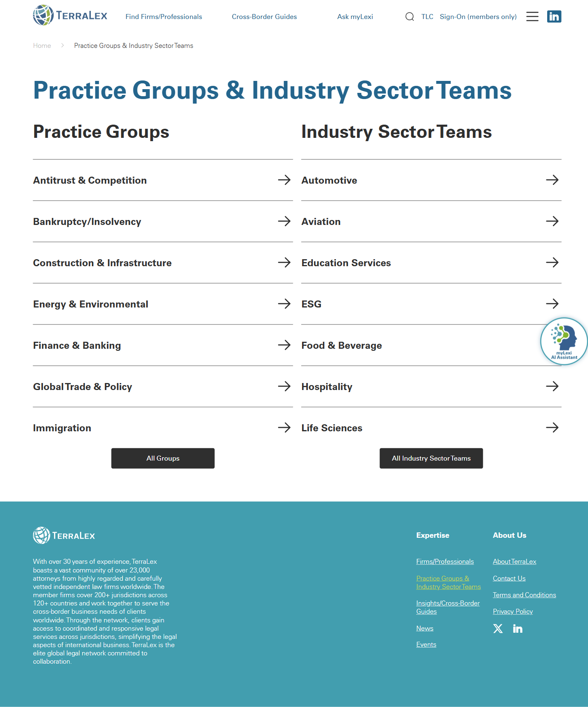

# Practice Groups & Industry Sector Teams

**Live URL:** https://www.terralex.org/practice-groups-Industry-sector-teams
**Local file (target):** new file: `practice-groups-industry-sector-teams.html`
**Page purpose:** Hub directory of TerraLex's practice groups and industry sector teams, letting visitors discover the network's specialized cross-border expertise and route to a relevant lead/group page.

**Live screenshot:** [../screenshots/11-practice-groups-industry-sector-teams.png](../screenshots/11-practice-groups-industry-sector-teams.png)

## Current state — observations
- Standard masthead + main menu + search; no hero image, no eyebrow, no lede copy. The page drops straight from the H1 ("Practice Groups & Industry Sector Teams") into two stacked sections.
- Two parallel directories rendered **stacked vertically**, not side-by-side: "Practice Groups" first, "Industry Sector Teams" beneath it. Both use identical neutral styling — no color, icon, or typographic differentiation between the two taxonomies.
- Each section shows ~7 entries as plain text-link "cards" (group name only) with a single "All Groups" / "All Industry Sector Teams" link suggesting the visible list is partial.
- Practice Groups visible: Antitrust & Competition, Bankruptcy/Insolvency, Construction & Infrastructure, Energy & Environmental, Finance & Banking, Global Trade & Policy, Immigration.
- Industry Sector Teams visible: Automotive, Aviation, Education Services, ESG, Food & Beverage, Hospitality, Life Sciences.
- No filters, no search-within, no tag chips, no category grouping, no sort, no count badges, no "featured group" treatment, no breadcrumbs, no sidebar.
- Cards carry name only — no chair/lead contact, no description, no jurisdiction count, no member-firm count, no last-activity date, no icon, no imagery.
- No introductory paragraph defining what a Practice Group or Industry Sector Team actually is, or how they differ. The closest contextual copy lives in the footer ("TerraLex boasts a vast community of over 23,000 attorneys…").
- Footer is the standard TerraLex footer; cookie banner overlays the bottom of the viewport.
- Mobile: a menu toggle is present but the directory itself is just stacked text — no mobile-specific affordance.

## What works (Pros)
- Directly scannable list of group names, predictable single click-through to detail.
- Equal visual weight between Practice Groups and Industry Sector Teams reinforces that both taxonomies are first-class.
- Lightweight DOM, fast to load, no media payload to wait on.
- Clear single intent: pick a specialism, go to its page.
- The two-axis taxonomy itself is genuinely useful — practice (legal discipline) × industry (client sector) is a credible cross-border framing.

## What doesn't work (Cons)
- [Content] No lede / value framing — visitors who land cold cannot tell what a "Practice Group" is, what an "Industry Sector Team" is, or how the two differ. The page reads as an internal sitemap, not a marketing surface.
- [UI] Plain text-link list undersells one of TerraLex's core differentiators (cross-border specialist coordination); visually flat with no icons, art, or color.
- [UI] Practice Groups and Industry Sector Teams are visually identical — no shape/color cue separating legal-discipline from client-sector.
- [UX] Only ~7 of each are shown above an "All Groups" link; users cannot see the full taxonomy at a glance and must take a second hop to browse it.
- [UX] No filters, search, or category chips; no way to combine practice × industry to find e.g. "Energy + Life Sciences regulatory leads".
- [Content] Cards expose name only — no chair/lead, no participating member-firm count, no jurisdiction reach, no recent activity, so the user can't judge depth before clicking.
- [UX] No featured / latest / recently active group treatment; the page is static and undifferentiated.
- [Accessibility] Two long link lists with no descriptive context per link; screen-reader users hear "Antitrust & Competition link, Bankruptcy/Insolvency link…" with no surrounding semantics.
- [Accessibility] Cookie banner overlays content with no easy first-paint dismiss path.
- [UI] Out of step with the new `index.html` visual language — no on-dark hero, no `ds-eyebrow`/`ds-thin`/`ds-bold` headline pattern, no card system, no accent color.
- [Mobile] Two stacked plain lists work on phone but offer no jump-to-section affordance and no sticky filter; on tall phones the second section is well below the fold with no signpost.
- [UX] No CTA at the bottom — once a user has scanned both lists and not clicked anything, there is no "talk to a member firm" or "ask myLexi" off-ramp.

## Redesign plan
- Lead with a confident dark hero reusing the `s8-hero` pattern from `index.html`: eyebrow "Specialist Coordination", split-weight headline ("Practice Groups & " thin / "Industry Sector Teams" bold), one-line value prop ("Cross-border specialists organized by legal discipline and by client sector"), plus a stat strip ("12+ practice groups · 12+ sector teams · 23,000 attorneys").
- A short two-sentence lede beneath the hero defining the difference: "Practice Groups coordinate counsel by legal discipline. Industry Sector Teams convene firms around a shared client industry."
- **Two parallel directories** rendered side-by-side on desktop (50/50), stacked on tablet/mobile, each with its own eyebrow + accent color so the user can read taxonomy at a glance:
  - Left column: "Practice Groups" (legal-discipline accent, e.g. existing `--ds-accent`).
  - Right column: "Industry Sector Teams" (a paired secondary accent already present in tokens).
- Replace the bullet/text-link list with a **filterable card grid** in each column built on the existing `s8-guide-card` component: icon chip, group name (`ds-h3`), 1-line description, lead-firm + chair name (`ds-body-sm`), participating-firm count chip, hover reveal with arrow link.
- Above each column: a search-within input + alphabetical sort toggle. A single global filter chip row at the top lets the user filter both columns by region (Americas / EMEA / APAC) using existing taxonomy.
- Featured group module: one large 2-col card ("Spotlight Group: ESG") at the top with a longer summary, sample matter, and chair photo placeholder — pure editorial pick, no backend.
- Pure front-end search/filter against `data-tags` and `data-region` attributes on each card. No CMS, no API — every group entry lives in a static JSON array embedded in the page.
- Closing CTA reusing the `s9-cta` band: "Need a specialism we don't list? Ask myLexi or a member firm." with primary + outline buttons.
- Visual language alignment with `index.html`: Source Sans 3 + DM Sans, `ds-display`/`ds-h1`/`ds-h3`/`ds-eyebrow` scale, `ds-accent`, dark hero with overlay image, white directory section, the same `ds-btn` primary/ghost system, the same footer block.
- Component reuse: header (`#siteHeader` + `#mainNav` + utility bar), footer (`.site-footer`), `s8-hero`, `s8-guide-card`, `s3b-tag` chip, `s9-cta` band, tokens from `css/tokens.css` and `css/design-system.css`. Page-specific styles in a new `css/practice-groups.css`.

## Instructions for Claude Code (implementation brief)
1. Target file: `practice-groups-industry-sector-teams.html` — new file in project root, mirroring the head/script wiring of `index.html`. Page-specific styles in a new `css/practice-groups.css`; load order: `tokens.css`, `base.css`, `header.css`, `design-system.css`, `responsive.css`, then `practice-groups.css` last. Page-specific JS in `js/practice-groups.js` (search/filter/sort only).
2. Reuse from `index.html` and `_design/`:
   - `<header class="site-header">` verbatim, with active-state on the Expertise → Practice Groups menu item.
   - `<footer class="site-footer">` verbatim.
   - `s8-hero` block for the page hero — swap headline/eyebrow copy, keep the dark image + overlay treatment.
   - `s8-guide-card` markup as the per-group card; add a small icon chip slot (top-left of card) plus a `data-region` and `data-tags` attribute set for filtering.
   - `s3b-tag` for filter chips and "X member firms" / region chips inside cards.
   - `s9-cta` band for the closing CTA.
   - Typography utilities: `ds-display`, `ds-h1`, `ds-h3`, `ds-eyebrow`, `ds-thin`, `ds-bold`, `ds-body`, `ds-body-sm`, `ds-accent`, `on-dark`. Buttons: `ds-btn`, `ds-btn-primary`, `ds-btn-ghost`, `ds-btn-outline`, `ds-btn-lg`.
3. Sections to build, in order:
   1. Site header (reused).
   2. Hero — dark, eyebrow + split-weight headline + one-line subhead + 3-stat strip.
   3. Lede band — two short sentences defining Practice Groups vs Industry Sector Teams (`ds-body` on light background, max-width readable measure).
   4. Global filter row — region chips (All · Americas · EMEA · APAC) + a single search input + sort toggle (A–Z / Featured). Filters apply to both directories simultaneously.
   5. Featured group spotlight — full-width 2-col card (image left, copy right, chair name, sample matter), one editor's-pick group.
   6. Two-column directory grid — left "Practice Groups", right "Industry Sector Teams". Each column has its own eyebrow + accent stripe and renders all groups as `s8-guide-card`s. Each card: icon chip, group name (`ds-h3`), 1-line description, region chip(s), "X member firms" chip, "View group" arrow link. Desktop 2-col / tablet 1-col stacked / mobile 1-col stacked. Each card carries `data-taxonomy="practice|industry"`, `data-region`, `data-tags`.
   7. Empty state per column — illustration + "No groups match these filters" + "Reset filters" link. Required when filters return zero in a column.
   8. CTA band reusing `s9-cta` — "Need a specialism we don't list? Ask myLexi or a member firm." with `ds-btn-primary` + `ds-btn-outline`.
   9. Site footer (reused).
4. **Backend constraint:** no terralex.org API or schema changes. All groups, descriptions, leads, and counts live in a static array embedded in the HTML or in a local `data/practice-groups.json`. Search, sort, and filtering are client-side only. The list of practice groups and industry sector teams should mirror the live page's full taxonomy (use the visible names as the seed: Antitrust & Competition, Bankruptcy/Insolvency, Construction & Infrastructure, Energy & Environmental, Finance & Banking, Global Trade & Policy, Immigration; Automotive, Aviation, Education Services, ESG, Food & Beverage, Hospitality, Life Sciences) plus any additional entries surfaced via the existing "All Groups" link.
5. Acceptance criteria:
   - Page is fully responsive at 360 / 768 / 1024 / 1440 widths; the two-column directory collapses cleanly to a single column with the Practice Groups section first.
   - Filter chips, search input, and sort all operate without page reload and produce no console errors when served via `npx serve . -l 8080`.
   - Visual language matches `index.html` (typography scale, color tokens, hero treatment, card hover states, accent usage).
   - Header active-state correctly highlights the Expertise nav item; all internal anchor links resolve.
   - Keyboard-accessible filters and cards (visible focus rings, ESC closes any open dropdown), Lighthouse a11y score >= 95.
   - No external dependencies beyond what `index.html` already loads.
