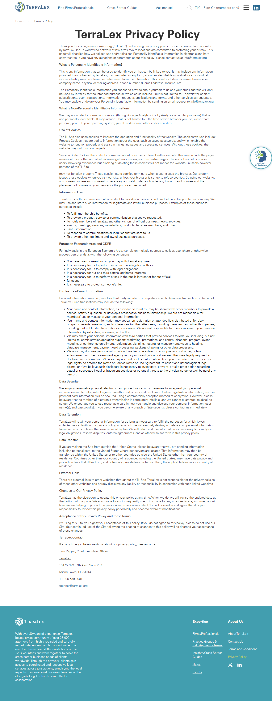

# Privacy Policy

**Live URL:** https://www.terralex.org/privacy-policy
**Local file (target):** new file: privacy-policy.html
**Page purpose:** Site privacy policy (legal) — explains what personal data TerraLex collects, how it's used, GDPR/EEA basis, cookies, retention, and contact for data requests.

**Live screenshot:** [../screenshots/20-privacy-policy.png](../screenshots/20-privacy-policy.png)

## Current state — observations
- **Sections present on the live page (H2 order):** What Is Personally Identifiable Information; What Is Non-Personally Identifiable Information; Use of Cookies (Process + Session State); Information Use; European Economic Area and GDPR; Disclosure of Your Information; Data Security; Data Retention; Data Transfer; External Links; Changes to Our Privacy Policy; Acceptance of this Privacy Policy and these Terms; TerraLex Contact.
- **Length:** ~2,200–2,400 words; long-form legal prose.
- **Last updated date:** **not present anywhere** on the page — no revision date, no version stamp.
- **Navigation aids:** none — no table of contents, no anchor jump-links, no back-to-top. Reader scrolls linearly.
- **Density:** moderate — H2s and a few bullet lists break the wall, but several sections are dense multi-paragraph prose with no sub-hierarchy (no H3s).
- **Jurisdiction blocks:** dedicated EEA/GDPR section with lawful-basis language; **no CCPA / California-specific block**, no UK-specific block.
- **Contact:** Terri Pepper, CEO; TerraLex, 15175 NW 67th Ave., Suite 207, Miami Lakes, FL 33014; +1-305-539-0001; CEO email + general inbox (both Cloudflare email-protected).
- **Layout:** standard legacy-template page — top nav, narrow body column, footer; no editorial hero, just the H1 over body copy.

## What works (Pros)
- **Comprehensive coverage** — PII vs non-PII definitions, cookies, GDPR, retention, transfer, security, and changes are all addressed.
- **Clear H2 spine** — section headings, while not anchored, do make the structure scannable in-page.
- **Bulleted breakdowns** in cookies and information-use sections prevent total wall-of-text.
- **Real human contact** — named CEO with full mailing address and phone number, not a generic "privacy@" alias.
- **Cloudflare email obfuscation** — basic anti-scrape protection on the contact addresses.

## What doesn't work (Cons)
- **No "last updated" date** [Content][Trust][Compliance] — the single most important credibility signal on a privacy policy is missing. GDPR/CCPA expectations include a visible revision date.
- **No table of contents / anchor nav** [UX] — a 2,400-word legal document with 13 H2s needs sticky TOC; readers can't jump to "Cookies" or "Your Rights."
- **No back-to-top control** [UX][Mobile] — long-scroll page with no return shortcut.
- **No CCPA / California block** [Content][Compliance] — TerraLex is Florida-based with US member firms; California residents get no dedicated rights notice.
- **No explicit "Your Rights" section** [Content] — GDPR rights (access, rectification, erasure, portability, objection) are implied inside the EEA paragraph rather than called out as a discrete, scannable list.
- **Measure too wide** [UI][Readability] — body copy inherits the site's wide content column; legal prose at ~90+ characters per line is fatiguing. Optimal measure is 60–75ch.
- **No H3 sub-hierarchy** [Content][UX] — sub-topics inside long sections (e.g., cookie types, transfer safeguards) are buried as inline bold rather than navigable subheads.
- **Hero is non-existent** [UI] — the page opens straight into H1 + paragraph; no eyebrow, no last-updated stamp, no "reading time" cue.
- **Email obfuscation hurts UX** [Accessibility][UX] — Cloudflare `/cdn-cgi/l/email-protection` links require JS to resolve; screen-reader and no-JS users get garbled output.
- **No print stylesheet implied** [Accessibility] — legal pages are commonly printed/saved to PDF; current template has no print optimisation.
- **No version history / change log** [Content][Trust] — "Changes to Our Privacy Policy" promises updates but offers no archive or changelog.
- **Generic-corporate visual style** [UI] — same legacy template feel as the rest of the site; no signal that this is a high-trust legal document.
- **Mobile experience untested but likely flat** [Mobile] — no sticky TOC or section anchors, so mobile readers get one continuous scroll with no orientation.

## Redesign plan
- **Direction:** treat this as a high-trust legal reading experience — minimal hero with title and prominent **Last updated** date, sticky table-of-contents on the left (collapses to a top accordion on mobile), narrow centred measure (~68ch) for the body, clear H2/H3 hierarchy, smooth-scroll anchors, back-to-top FAB. Group sections logically: (1) Data we collect, (2) How we use it, (3) Sharing & disclosure, (4) Your rights (GDPR + CCPA broken out as H3s), (5) Security, retention, transfers, (6) Cookies, (7) Changes & contact.
- **Shared template flag:** this page and `terms-and-conditions.html` share the same layout pattern (long-form legal, sticky TOC, last-updated stamp, back-to-top, narrow measure). The implementation phase should build **one shared base template / partial** (e.g., `legal-doc` layout class with hero + TOC + body + back-to-top) and reuse it for both — Privacy Policy and T&Cs differ only in content and TOC entries.
- **Component reuse from `index.html`:** `.site-header` + `.nav-topbar` + `.nav-mega` (verbatim), header logo white→default scroll swap, `.site-footer` (verbatim), all design-system typography tokens (`ds-display`, `ds-h1`, `ds-h2`, `ds-eyebrow`, `ds-body-lg`, `ds-body`).
- **New components needed (page-local CSS only):**
  - `.legal-hero` — slim on-light hero: eyebrow "Legal," H1 title, last-updated badge (`Last updated: 30 April 2026`), one-line lede, optional "reading time ~10 min" cue.
  - `.legal-toc` — sticky left-rail TOC (`position: sticky; top: <header-height>`); active-section highlight via IntersectionObserver; collapses to a top `
` accordion under a breakpoint.
  - `.legal-body` — narrow centred article (max-width ~68ch) with H2/H3 hierarchy, generous line-height, anchor-target offset to clear sticky header.
  - `.legal-back-to-top` — fixed bottom-right FAB, fades in after scroll past hero.
- **Typography & tokens:** inherit existing `ds-*` tokens. No new tokens. Add a `prose`-style spacing rhythm scoped to `.legal-body` (paragraph margins, list indents, H2/H3 top-margin) so both legal pages render identically.

## Instructions for Claude Code (implementation brief)
1. Target file: `privacy-policy.html` — **new file**. Scaffold from `index.html`'s `<head>`, `.site-header`, and `.site-footer`; copy verbatim so nav, logo-swap, and footer columns match. Link the same `css/design-system.css` and `css/responsive.css`. Build a **shared legal layout** (header + `.legal-hero` + `.legal-toc` + `.legal-body` + `.legal-back-to-top` + footer) so the same skeleton can be reused by `terms-and-conditions.html` later — keep page-specific CSS in a single shared block (e.g., `css/legal.css` or an inline `<style>` block that will be lifted to a shared file in the T&Cs pass).
2. Reuse without modification: `.site-header`, `.nav-topbar`, `.nav-mega`, `.site-footer`, all `ds-*` typography classes, header scroll-state logo swap.
3. Sections to build, in order:
   1. **Hero (`.legal-hero`)** — eyebrow "Legal," H1 "Privacy Policy," prominent **Last updated** badge, one-line lede ("How TerraLex collects, uses, and protects your information."), optional reading-time hint. On-light, slim, no full-bleed image.
   2. **Sticky TOC (`.legal-toc`)** — left rail on desktop, top accordion on mobile. Entries: Information We Collect → How We Use It → Cookies → Sharing & Disclosure → Your Rights (GDPR, CCPA as H3 sub-items) → Data Security → Retention → International Transfers → External Links → Changes → Contact. Smooth-scroll on click, active-link highlight via IntersectionObserver.
   3. **Body (`.legal-body`)** — narrow measure (~68ch). Render the live policy content reorganised under the TOC structure above, breaking long sections into H3s (e.g., Cookies → Process Cookies / Session-State Cookies; Your Rights → GDPR Rights / California Rights placeholder). Preserve all existing legal language; only restructure and add headings. Insert anchor IDs matching TOC slugs (`#information-we-collect`, etc.) with `scroll-margin-top` set to clear the sticky header.
   4. **Contact block** — final section: name, postal address, phone as `tel:` link, email as plain `mailto:` link (drop Cloudflare obfuscation in favour of accessibility — or keep it if the team requires; flag as a content decision).
   5. **Back-to-top FAB (`.legal-back-to-top`)** — fixed bottom-right, fades in after scroll past hero, smooth-scrolls to top.
   6. **Footer** — reuse `.site-footer` verbatim.
4. **Backend constraint:** no backend changes. Page is fully static HTML. Last-updated date is a hard-coded string in the markup. TOC is hand-authored markup, not generated. No CMS, no API, no JS framework.
5. Acceptance criteria:
   - Renders without console errors when served via `npx serve . -l 8080`.
   - Responsive at the project's existing breakpoints in `css/responsive.css`; sticky TOC collapses to a top accordion below the tablet breakpoint.
   - Header logo swaps white → default on scroll, identical to `index.html`.
   - All TOC links smooth-scroll to the correct anchor and the active section highlights as the user scrolls.
   - Body measure does not exceed ~72ch on any viewport width.
   - Last-updated date is visible above the fold on desktop and mobile.
   - All phone numbers are `tel:` links; all emails are `mailto:` links (or documented Cloudflare-protected equivalents).
   - Back-to-top FAB appears only after scrolling past the hero and is keyboard-focusable.
   - Print stylesheet hides the TOC, header, footer, and back-to-top FAB; body prints at full width with anchors expanded.
   - Layout components (`.legal-hero`, `.legal-toc`, `.legal-body`, `.legal-back-to-top`) are authored so they can be reused verbatim by `terms-and-conditions.html`.
