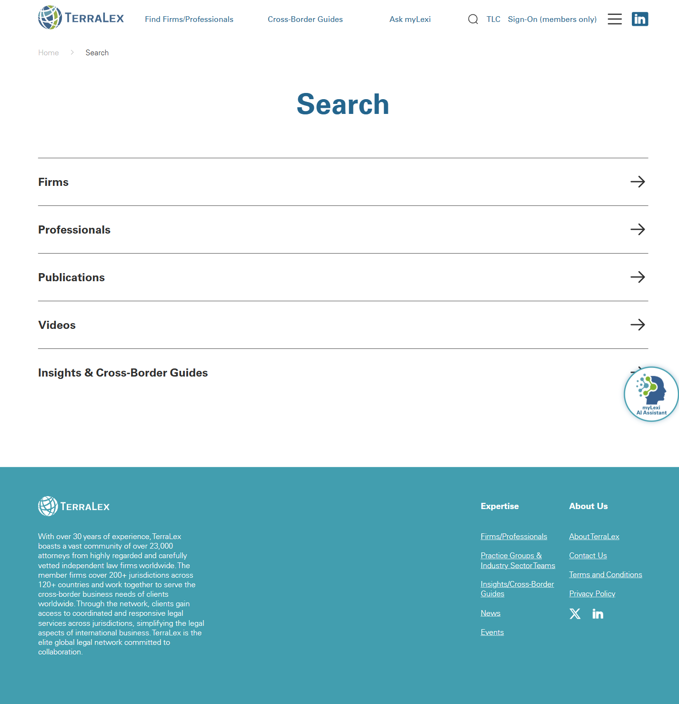

# Search

**Live URL:** https://www.terralex.org/search
**Local file (target):** new file: search.html
**Page purpose:** Site-wide search results page — a single entry point that returns matching firms, attorneys (professionals), guides/publications, and news from across the TerraLex site.

**Live screenshot:** [../screenshots/16-search.png](../screenshots/16-search.png)

## Current state — observations
- Search is surfaced as a primary feature in the global header, but the dedicated `/search` route lands cold: no hero, no editorial framing, and the query is not echoed back as a visible page heading once submitted.
- Results are scoped through a fixed set of category tabs surfaced by the live page: **Firms**, **Professionals**, **Publications**, **Videos**, **Insights & Cross-Border Guides**. There is no "All / everything" combined view — the user must pick a tab to see anything, which forces a guess about where their answer lives.
- The page is JavaScript-rendered: the static HTML returns navigation, footer, and the cookie banner only — no result markup is present pre-hydration, and no `?q=` echo is shown in the static document. WebFetch of `/search?q=law` returns the same empty shell, confirming that all result rendering happens client-side against the existing search backend.
- Result card design is undifferentiated across types: every hit (firm, person, guide, news article) appears to render as a plain text link with minimal supporting metadata — no type badge, no thumbnail, no jurisdiction flag, no excerpt, no date.
- No visible faceted filters (region, jurisdiction, practice, content type beyond the top tabs), no sort control (relevance / date / A–Z), and no result-count display ("23 results for 'law'").
- No visible pagination, "load more", or infinite-scroll affordance in the static markup.
- No-results / zero-state copy is not visible in the shipped HTML — empty queries and no-match queries likely render as a blank tab body.
- "Ask myLexi" branding appears in the global chrome and is a natural sibling to a search experience, but it is not promoted on the `/search` page itself.
- Footer is the standard TerraLex block; cookie banner overlays the bottom of the viewport.
- Mobile: header collapses, but tab-strip + result-list density on small screens is not differentiated; the tab row will need horizontal-scroll treatment.

## What works (Pros)
- The category set is the right taxonomy — Firms / Professionals / Publications (Guides) / News map cleanly to the four content types users come to TerraLex for.
- One global search entry point in the header is the correct pattern for a directory-led network site.
- Routing is URL-based (`/search?q=…`), which means the redesigned page can hydrate against the same query string without backend changes.
- Lightweight chrome means the redesign has room to add hierarchy (echoed query, result counts, type badges) without crowding.

## What doesn't work (Cons)
- [UX] Query is not echoed back on the results page — users lose the "you searched for X" anchor and can't tell what they typed without looking at the URL.
- [UX] No "All results" combined view — users must guess which tab their hit lives in, especially when the term spans types (e.g. "Garrigues" is both a firm and a set of news mentions).
- [UX] No result count per tab and no per-tab badge (e.g. "Firms 4 · Professionals 12 · Guides 2") so the user can't see at a glance where the matches are concentrated.
- [UX] No sort control and no facets beyond the top tabs — guides can't be filtered by practice, professionals can't be filtered by jurisdiction, news can't be filtered by date.
- [UX] No pagination affordance — long result sets either silently truncate or scroll forever with no termination cue.
- [UI] Result cards are visually flat: text-only links, no type badge, no thumbnail, no flag for firms, no avatar for people. Every hit looks the same regardless of what it is.
- [UI] No visible loading skeleton — between submit and hydration, the user stares at an empty tab.
- [Content] No no-results state copy ("No matches for 'X' — try a broader term, browse the directory, or ask myLexi"). Empty queries show nothing instead of suggested categories or recent guides.
- [Content] No query-suggestion / did-you-mean / related-searches scaffolding around an empty state.
- [Accessibility] Tab strip likely lacks proper `role="tablist"` / `aria-selected` semantics; no `aria-live` region announcing result counts after hydration.
- [Accessibility] Echoed query absent from `<h1>` means screen readers don't get a heading anchor for the results context.
- [Mobile] Tab strip with 5 categories will overflow on narrow widths; needs horizontal-scroll-snap or a "More" overflow.
- [Mobile] Result cards as plain text links collapse to an undifferentiated wall on small screens — type badges and 1-line meta become essential.

## Redesign plan
- Direction: a **focused results page** that re-uses the search backend exactly as it exists today and only restyles the presentation. The page hydrates from `?q=…` (already supported), reads the same JSON the live tabs read (or, for the local prototype, a hand-rolled `data/search-mock.json` fixture mirroring the live response shape), and re-renders it into a modern, type-aware results list.
- Top-down structure: site header → large query bar (echoes the current query, supports refinement) → tab/filter row with per-tab counts → results list with type badges and type-specific cards → pagination → footer.
- Each result type renders with a **type-tagged card variant**: Firm card (flag + city + jurisdiction + practice chips), Professional card (avatar circle + role + firm + jurisdiction), Guide/Publication card (eyebrow practice + title + 2-line excerpt + jurisdiction tag), News card (date + headline + 1-line dek + tag pills) — all in the same vertical list rhythm but distinguishable at a glance via a colored type badge in the top-right of each card.
- Add a no-results state with three rescue paths: "Browse member firms", "Browse cross-border guides", "Ask myLexi" — each a `ds-btn` linking to the relevant index page.
- Visual language alignment with `index.html`: Source Sans 3 + DM Sans, `ds-display` / `ds-h1` / `ds-h3` / `ds-eyebrow` scale, accent color via `ds-accent`, white results surface on neutral background, `ds-btn` primary/ghost vocabulary, the same footer block.
- Component reuse from `index.html` / existing pages: header (`.site-header` + `#mainNav` + utility bar), footer (`.site-footer`), tag chip (`.s3b-tag`), card hover pattern from `.s6-event` / `.s4-card-reveal`, button utilities (`ds-btn`, `ds-btn-primary`, `ds-btn-ghost`), tokens from `css/tokens.css` and `css/design-system.css`. Page-specific styles in a new `css/search.css`.

## Instructions for Claude Code (implementation brief)
1. Target file: `search.html` — new file at project root, sibling to `index.html`. Page-specific JS in `js/search.js`, page-specific CSS in `css/search.css`. Local fixture in `data/search-mock.json` mirroring the live `/search` response shape (arrays keyed by `firms`, `professionals`, `publications`, `videos`, `guides`, `news`).
2. Reuse from `index.html`: copy global header markup verbatim (utility bar + main nav + mega menu) and footer block. Reuse typography utilities (`ds-display`, `ds-h1`, `ds-h3`, `ds-eyebrow`, `ds-body`, `ds-body-sm`, `ds-thin`, `ds-bold`, `ds-accent`), button utilities (`ds-btn`, `ds-btn-primary`, `ds-btn-ghost`), tag chips (`.s3b-tag`), and card hover pattern from `.s6-event`. Load `css/tokens.css`, `css/base.css`, `css/header.css`, `css/design-system.css`, `css/responsive.css`, then `css/search.css` last.
3. Sections to build, in order:
   1. Site header (identical to `index.html`).
   2. Query band — full-width neutral surface, eyebrow "Search", `ds-h1` "Results for **\"<echoed query>\"**" (query injected from `?q=` on hydration), one large search input below the heading pre-filled with the current query (refinement affordance, submits back to `/search?q=…`).
   3. Tab/filter row — sticky under the header on scroll. Tabs: All · Firms · Professionals · Guides · News (subset/rename of the live taxonomy: collapse "Publications" + "Insights & Cross-Border Guides" into "Guides"; defer "Videos" out of scope for the prototype). Each tab carries a count pill ("Firms 4"). "All" is the new default and renders a mixed list grouped by type.
   4. Results list — vertical stack of cards, ~720px max-width column. Card variants by type (Firm / Professional / Guide / News) as described in the redesign plan; each card carries a colored type badge in the top-right corner. Hover reveals a right-arrow on the title.
   5. No-results state — illustration + "No matches for '<query>'" + three rescue CTAs ("Browse firms", "Browse guides", "Ask myLexi"). Triggered when the active tab returns zero.
   6. Pagination — front-end-only, 10 results per page, numbered pager with prev/next arrows, hides itself when total ≤ 10.
   7. Footer (identical to `index.html`).
4. **Backend constraint:** the search backend on terralex.org is what we're styling around. Do not propose a new search engine, a new index, a new query API, or relevance-algorithm changes. The redesigned page must hydrate from the existing `?q=` query string and the same response payload the live `/search` page already consumes; for the local prototype, mirror that payload shape in `data/search-mock.json` and read it client-side. All tabs, counts, and pagination are derived from that single in-memory dataset — no new endpoints.
5. Acceptance criteria:
   - Renders correctly via `npx serve . -l 8080` with zero console errors and zero 404s on assets.
   - `search.html?q=law` echoes "law" in the `<h1>` and pre-fills the search input.
   - Tab counts match the underlying fixture; switching tabs filters the list without a page reload.
   - "All" tab groups results by type with a small section heading for each group.
   - Each result card shows a type badge and the type-appropriate metadata (flag for firms, avatar for people, date for news, practice eyebrow for guides).
   - No-results state renders when the active tab is empty; rescue CTAs link to `firms.html`, `insights-cross-border-guides.html`, and `mylexi.html`.
   - Pagination works on the client and disappears when total ≤ 10.
   - Responsive at 1440 / 1024 / 768 / 375; tab strip horizontally scrolls on mobile; result cards collapse to single-column with type badge moved inline.
   - Header + footer visually identical to `index.html`.
   - Keyboard-accessible: tabs are real `<button role="tab">` with `aria-selected`, results list has an `aria-live="polite"` region announcing the new count after each tab/query change, focus styles inherit from the design system.
