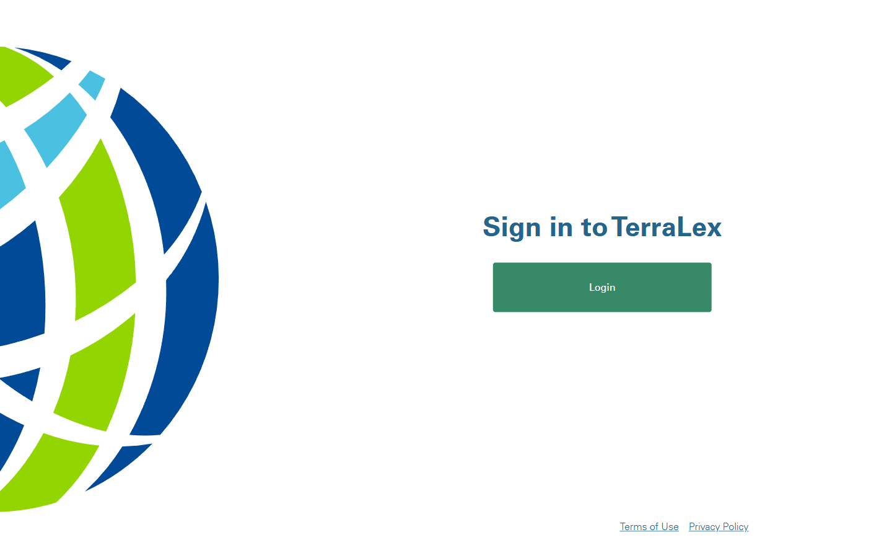

# Sign-in

**Live URL:** https://www.terralex.org/sign-in
**Local file (target):** new file: `sign-in.html`
**Page purpose:** Member intranet sign-in page — gateway to authenticated tools (Connected Community, member directory, knowledge base) for lawyers at TerraLex member firms.

**Live screenshot:** [../screenshots/17-sign-in.png](../screenshots/17-sign-in.png)

## Current state — observations
- **Layout is a centered single column.** TerraLex logo at top, page title, a single "Login" button, and the global footer compliance links. No split-screen, no brand visual, no value-prop copy, no imagery.
- **No email/password form on the page itself.** Authentication is delegated entirely to Auth0 — the "Login" button links straight to `https://api5.terralex.org/api/connect/auth0`, which hosts the actual credential form. The live `/sign-in` URL is effectively a one-button gate page.
- **No remember-me, no forgot-password, no help link on the gate page.** Those affordances live on the Auth0-hosted screen after the click, not here.
- **No headline / no subhead / no welcome copy.** The page does not explain who can sign in, what they will get access to, or what to do if they are not yet a member.
- **No contact / help block.** A lawyer who cannot sign in (lost credentials, never received invite, wrong firm) has no in-page route to support — they must hunt back to the global Contact page.
- **Brand treatment is minimal.** Default light background, the wordmark, a single button — no member-network imagery, no globe, no firm logos, nothing that signals this is the gateway to a 21,000-lawyer network.
- **Footer present** with "Terms of Use" and "Privacy Policy" only — much lighter than the global footer.
- **Header presumably inherits the global site-header** but its dropdowns (Expertise mega panel, etc.) are unnecessary noise on a transactional auth page.
- **Mobile:** centered single column collapses cleanly, but the lack of any visual content means the mobile view is essentially a blank page with a button — feels broken.
- **Copy tone:** no copy at all to evaluate.

## What works (Pros)
- **Auth flow is delegated cleanly to Auth0** — credentials, MFA prompts, error states, password reset are all handled outside this page. The redesign does not need to touch any of that and must not break the link to `api5.terralex.org/api/connect/auth0`.
- **Page is fast and uncluttered** — no JS form to validate, no third-party widgets, just a button. Performance baseline is excellent.
- **Footer compliance links are correct** and already point at `/terms-and-conditions` and `/privacy-policy`.
- **Single CTA = single decision** — visitor cannot be confused about what to do next.

## What doesn't work (Cons)
- **Page wastes the brand moment** [UI] — the sign-in page is the second-most-visited page after the homepage for returning members; it currently has zero brand expression, zero member-network imagery, zero typography hierarchy from the rest of the site.
- **No split-screen or value-prop column** [UI] — competitors and peer professional networks (Lex Mundi, Meritas, Linklaters intranet) all use a left-brand / right-action layout that reassures the user they are in the right place.
- **No welcome / "what you'll access" copy** [Content] — a returning member has no "Welcome back" line; a first-time invitee has no orientation about what they are signing into.
- **No "not a member?" path** [Content][UX] — a non-member who lands on this URL has no soft handoff back to `/about` or `/firms` or "Contact us about membership".
- **No help / contact block for sign-in trouble** [UX] — lost-credentials and wrong-firm users hit a dead end. Should at minimum surface a `mailto:` or contact link.
- **Header is full marketing-site nav** [UX] — Expertise mega-panel, News, About, etc. are noise on an auth gate. The sign-in page should use a simplified header (logo + minimal links).
- **Footer is the stripped legal-only footer** [UX] — the gate page mixes a heavy marketing header with a thin legal footer, which feels inconsistent.
- **No accessibility focus state defined for the single button** [Accessibility] — high-stakes button on an otherwise empty page; focus ring and `aria-label` need to be deliberate.
- **Mobile reads as empty** [Mobile] — centered button on a blank screen looks like a misload.
- **No reassurance about who-can-sign-in** [Content] — "Member-firm lawyers and staff only" is never stated; reduces trust.

## Redesign plan
- **Direction — split-screen brand-left / action-right gate page.** Left half carries the brand visual + value prop ("Welcome back to TerraLex / The connected community of 21,000 lawyers across 207 jurisdictions"). Right half carries the simplified action card with the single "Sign in" button that still routes to Auth0, plus a help/contact block underneath. No new auth flow — the button target URL stays `https://api5.terralex.org/api/connect/auth0`.
- **Component reuse from `index.html`:** simplified `site-header` variant (logo + "Contact" + "About TerraLex" only, no Expertise mega panel), `ds-h1` / `ds-thin` / `ds-bold` display typography for the welcome headline, `ds-body-lg` for supporting copy, the existing button styling used for primary CTAs in Section 9, the globe / member-network visual language from the homepage hero (static still, not the live canvas — too heavy for a gate page), and the global `site-footer` (full version, not the legal-only stub).

## Instructions for Claude Code (implementation brief)
1. Target file: `sign-in.html` — new file, sibling of `index.html`, `firm.html`, `mylexi.html`. Reuse the same `<head>`, font loads, and `ds-*` token CSS from `index.html`.
2. Reuse: simplified `site-header` (logo + "About TerraLex" + "Contact" + the existing "Sign in" link disabled/highlighted as current page — strip the Expertise mega panel and search), full `site-footer` from `index.html`, typography tokens (`ds-thin`, `ds-bold`, `ds-accent`, `ds-body-lg`), and the primary-CTA button styling.
3. Sections to build, in order:
   1. **Simplified header** — logo (clickable → `index.html`), right-aligned thin nav with "About TerraLex", "Contact", and a muted "Sign in" pill marked as current page. No mega panels, no search.
   2. **Split-screen body (50/50 desktop, stacked mobile):**
      - **Left panel — brand + value prop.** Dark background, member-network still image (reuse a flattened export of the homepage globe or a curated firms-on-map static asset under `assets/images/`). Eyebrow "Member sign-in", `ds-thin` + `ds-bold` headline "Welcome back to TerraLex.", `ds-body-lg` subhead "The connected community of 21,000 lawyers across 141 firms in 207 jurisdictions." Small footnote "Member-firm lawyers and staff only."
      - **Right panel — action card.** Light background, centered card. Eyebrow "Sign in to your account". Short supporting line: "You'll be redirected to our secure sign-in." Primary button **"Sign in"** that links to `https://api5.terralex.org/api/connect/auth0` (do not change this target — Auth0 hosts the actual email/password, remember-me, and forgot-password screens). Underneath, a thin help row: "Trouble signing in? Contact your firm administrator or [email TerraLex support](mailto:support@terralex.org)." Below that, a soft handoff: "Not a member firm? Learn about [TerraLex membership](/about)."
   3. **Trust strip (thin, 1 row, on light bg, below the split):** four small inline items — "Member-firm-only access", "Secure sign-in via Auth0", "Available in 100+ languages", "24/7 access to myLexi". Static text, no counters needed.
   4. **Footer** — full `site-footer` from `index.html` (not the legal-only stub).
4. **Backend constraint:** the auth backend stays as-is. Do **not** propose or implement passwordless, social SSO, MFA additions, magic links, or any new credential UI on this page. The single primary button must continue to route to `https://api5.terralex.org/api/connect/auth0`. Email/password, remember-me, and forgot-password are owned by the Auth0-hosted screen and are out of scope. This is a restyle of the gate page only.
5. Acceptance criteria: responsive (1440 / 1024 / 768 / 375), split-screen collapses to brand-on-top / action-below at <900px, Auth0 link target unchanged and verified by clicking, primary "Sign in" button has visible focus ring and `aria-label="Sign in to TerraLex member intranet"`, hero left-panel passes WCAG AA contrast on dark background, no console errors, page works via `npx serve . -l 8080`.
