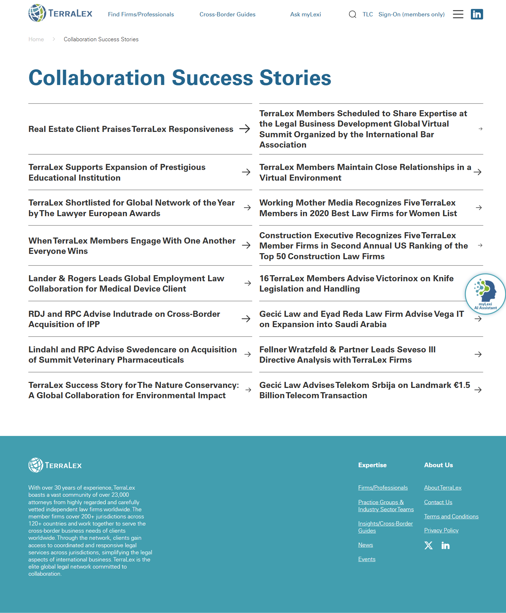

# Success Stories

**Live URL:** https://www.terralex.org/success-stories
**Local file (target):** new file: success-stories.html
**Page purpose:** Index of cross-border collaboration case studies showcasing member-to-member referral wins — proof points for "the network delivers."

**Live screenshot:** [../screenshots/14-success-stories.png](../screenshots/14-success-stories.png)

## Current state — observations
- No hero or banner — the page opens cold with a plain "Collaboration Success Stories" heading; no editorial framing of why these stories matter or how to read them.
- Stories render as a vertical, text-only list of clickable headlines — no thumbnails, no excerpts, no firm names, no region or practice tags surfaced at the index level.
- ~8 stories visible; titles are long and corporate-formal ("TerraLex Supports Expansion of Prestigious Educational Institution", "Real Estate Client Praises TerraLex Responsiveness").
- No filters, no sort, no search, no pagination, no load-more — the list just ends.
- No metadata is visible until click-through: region, practice area, firms involved, date, and outcome are all hidden behind the headline.
- Imagery is absent on the index; click-through pages (per home page Section 4 carousel) show that story-matched photography exists in `assets/images/case-studies/` — it is simply unused at the index level.
- Density is high (text list, tight spacing) but information density is low (one field per row).
- The home page already features a polished pattern in Section 4 (`s4-cards-track`, lines 462–547 of `index.html`): four cards with full-bleed image background, dual tag pills (practice + geography), large white headline, hover-reveal excerpt, "Read story" CTA. This is the pattern to promote.
- Footer is the standard TerraLex block; cookie banner persists.
- Mobile: text list collapses fine but loses what little hierarchy it had — no visual anchors at all.

## What works (Pros)
- Headline-only density means the full list is scannable in one viewport — low cognitive load if you already know what you're looking for.
- Clean chrome — header + footer don't fight the content.
- The taxonomy clearly exists in the underlying stories (practice area, region, firms involved) — it's just not surfaced.
- The home page Section 4 cards (`s4-card`, `s4-tag-pill`, `s4-geo-pill`, `s4-card-title`, `s4-card-reveal`) are already a strong, on-brand index card primitive ready to be lifted.

## What doesn't work (Cons)
- [UX] No featured/lead story — the most impactful win (€1.5B Telekom Srbija deal, $15M Swiss fintech, etc.) gets no more weight than any other entry.
- [UX] No filters by region or practice area — directly contradicts the page's core value proposition (a *cross-border, multi-practice* network).
- [UX] No excerpt, no firms-involved, no date — users can't triage without clicking through; the index is a wall of long titles.
- [UX] No load-more / pagination — feed termination is unclear and there's no path to deeper archive.
- [UI] No imagery anywhere on the index — the page reads as a plain text list, completely off-brand vs. the visual richness of `index.html`.
- [UI] No hero — the page lands cold; no eyebrow, no dek, no editorial voice.
- [Content] Headlines run 60–110 characters with no excerpt to support them; tone is uniformly formal corporate-PR — no scannable outcome ("€1.5B deal", "Cross-border M&A, Sweden ↔ UK").
- [Accessibility] List is just `<a>`s — no semantic grouping, no announced filter state (since there are no filters), no per-item metadata for screen readers.
- [Mobile] Long titles wrap into 3–4-line blocks on narrow widths with zero supporting context — even less scannable than desktop.

## Redesign plan
- Direction: **case-study magazine index** — featured lead story on top (full-bleed image, eyebrow practice + region, big headline, 2-line outcome dek, firms involved, date, Read CTA), then a 3-column responsive card grid below; sticky filter chip strip between hero and grid lets users slice by region OR practice.
- Visual language is a direct lift of Section 4's `s4-card` pattern (image-bg + dual pills + headline + hover-reveal excerpt) — but the index variant always shows the excerpt and metadata (no hover-only reveal) so cards are scannable at a glance.
- Component reuse from `index.html`: global header, footer, `.ds-h1/.ds-h2/.ds-h3/.ds-eyebrow/.ds-body` typography, `.ds-btn-primary` / `.ds-btn-secondary` buttons, `.s4-tag-pill` (practice) + `.s4-geo-pill` (region), `.s4-card-bg` ratio + image treatment, `.s4-card-link` arrow CTA.
- Promote the four Section 4 cards (Telekom Srbija, The Nature Conservancy, Swiss Fintech, Cibes Elevators) as the seed content — imagery + copy already exist. Add ~8 more synthetic entries to demonstrate grid density, filter behaviour, and load-more.
- Filter row: two parallel chip strips (Practice: All / M&A / Telecom / Fintech / Real Estate / Environmental / Regulatory; Region: All / Americas / Europe / APAC / MEA). Front-end-only — toggle visibility via `data-practice` and `data-region` attributes. Sticky under header on scroll.
- Load-more: `ds-btn-primary` centred under grid, reveals next batch of hidden cards on click; hides itself when exhausted.
- CTA block before footer: "Have a cross-border matter? Find a member firm." → links to `firms.html`.

## Instructions for Claude Code (implementation brief)
1. Target file: `success-stories.html` — new file at project root, sibling to `index.html`.
2. Reuse: copy the global header markup (logo + nav + member sign-in) and footer block from `index.html` verbatim. Reuse all design-system tokens (`ds-h1`, `ds-h2`, `ds-h3`, `ds-eyebrow`, `ds-body`, `ds-bold`, `ds-thin`, `ds-accent`, `ds-btn-primary`, `ds-btn-secondary`, `on-dark`). Promote the `s4-card` / `s4-card-bg` / `s4-tag-pill` / `s4-geo-pill` / `s4-card-title` / `s4-card-reveal` / `s4-card-link` pattern from Section 4 (lines 462–547 of `index.html`) into a reusable `.story-card` class for this page; lift the four existing card images from `assets/images/case-studies/` as seed content.
3. Sections to build, in order:
   1. Global header (reused from `index.html`).
   2. Page hero — slim banner, eyebrow "Success Stories", `ds-h1` heading "**Collaboration** Success Stories." (reuse Section 4 split-weight heading style), one-line dek (e.g. "Cross-border wins delivered by TerraLex member firms working as one team.").
   3. Featured story — full-width 16:9 image left, copy block right (eyebrow practice + region pills, large headline, 2-line outcome excerpt, firms-involved line in small caps, date, `ds-btn-primary` "Read story"). Use the Telekom Srbija €1.5B story as the seed.
   4. Filter row — two horizontally-scrollable chip strips stacked (Practice / Region), sticky under header on scroll. Real `<button>` elements with `aria-pressed` for selected state.
   5. Story card grid — 3 columns desktop, 2 tablet, 1 mobile. Each card: image (16:9, hover scale), practice pill + region pill, headline (`ds-h3`), 2-line excerpt, firms-involved line in muted small caps, date. ~12 cards total for the prototype (4 seeded from Section 4 + 8 synthetic).
   6. Load-more button — `ds-btn-primary` centred below grid; pure JS reveals next 6 hidden cards on click; hides itself when none remain.
   7. CTA block — dark band, `ds-h2` "Have a cross-border matter?" + `ds-btn-secondary` "Find a member firm" → `firms.html`.
   8. Footer (reused from `index.html`).
4. **Backend constraint:** do not propose features that require terralex.org backend changes. Filtering, pagination, and search must be front-end-only (client-side `data-practice` / `data-region` toggling, hardcoded card list in markup). No CMS, no API, no auth. Local prototype = static HTML/CSS/JS only.
5. Acceptance criteria:
   - Renders correctly via `npx serve . -l 8080` with zero console errors and zero 404s on assets.
   - Responsive at 1440 / 1024 / 768 / 375 widths; grid collapses 3 → 2 → 1; filter strips become horizontal-scroll on mobile.
   - Filter chips toggle visible cards by `data-practice` AND `data-region` (intersected); "All" in each strip resets that axis; active chips have visible selected state with `aria-pressed="true"`.
   - Load-more reveals hidden cards in batches of 6 and disappears when exhausted.
   - Featured story is visually distinct from grid cards (full-width, larger type, copy beside image — not stacked).
   - Header + footer visually identical to `index.html`.
   - Keyboard-navigable: chips are real `<button>`s, cards are `<a>`s wrapping the whole card surface, focus styles inherit from the design system.
