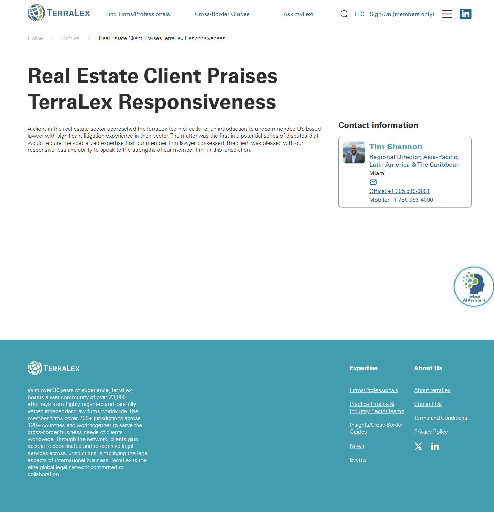

# Success Story detail (templated) — Redesign Benchmark

- **Page name:** Success Story detail (templated)
- **Live URL (representative):** https://www.terralex.org/success-stories/real-estate-client-praises-terralex-responsiveness
- **Local target file:** `success-story-detail.html` (new)
- **Page purpose:** Templated detail page for a single success story / case study — proves the network's value through narrative evidence (cross-border collaboration, member responsiveness, client outcomes).
- **Live screenshot:** [../screenshots/15-success-story-detail.png](../screenshots/15-success-story-detail.png)



---

## Current state — observations

Based on WebFetch of the live page (and the `/success-stories` index for context).

### Hero
- Plain centered H1: "Real Estate Client Praises TerraLex Responsiveness."
- No featured image, no kicker/eyebrow, no region or practice tags, no publish date, no read-time, no breadcrumb.
- Hero sits flush under the global nav; no editorial framing or lede.

### Body
- Single short narrative paragraph. No subheads, no pull-quote, no deal-value callout, no bullets, no inline imagery.
- No structured "Challenge / Solution / Outcome" pattern, which is standard for case studies.
- No client logo, no anonymised industry badge, no timeline.

### Attribution
- Below the body: avatar of Tim Shannon (Regional Director, Asia-Pacific, LatAm & Caribbean), location Miami, office + mobile phone.
- Treated as a contact block — not as "firms involved" attribution. There is no list of the member firms that actually delivered the work.

### Related / next steps
- No related stories block.
- No CTA to browse more success stories, find a firm, or contact a regional director by need.
- No share controls.

### Index page (for context)
- `/success-stories` is a flat vertical list of 8 title-only links — no cards, no images, no filters by region / practice / industry, no dates. So the detail page is also the only place to surface story metadata, and it currently surfaces almost none.

---

## Pros
- Clean single-column reading width; nothing distracts from the narrative.
- Title is descriptive and outcome-led ("Praises TerraLex Responsiveness").
- Attribution puts a real, contactable person at the bottom — good trust signal.
- Footer carries the network's scale ("23,000 attorneys") consistently across pages.

---

## Cons (tagged)

- **[hero]** No imagery, no eyebrow, no tags, no date — hero is a bare H1, reads like a press blurb, not a case study.
- **[hero]** No region / practice / industry chips, so the story is unsearchable and uncontextualised.
- **[content]** Body is one paragraph. No Challenge / Solution / Outcome scaffolding, no pull-quote, no metrics or deal value.
- **[content]** No inline imagery, no client logo, no anonymised industry mark.
- **[attribution]** Member firms that actually did the work are not credited — undermines the whole point of a network success story.
- **[attribution]** Contact block uses raw phone numbers as plain text — no `tel:` affordance, no email, no LinkedIn.
- **[ia]** No breadcrumb, no "back to Success Stories."
- **[discovery]** No related / next stories, no tag-based "more like this," no share.
- **[seo]** No date, no author, no structured metadata visible — poor for crawlers and for human credibility.
- **[a11y]** Centered H1 with no landmark structure beneath; single paragraph with no headings means screen-reader users get no skim affordance.
- **[brand]** Page does not look like part of TerraLex — no editorial system, no globe / map cue, no regional flag/locale signal.

---

## Redesign plan

Reuse the global header, footer and typography tokens from `index.html`. Build an editorial, scannable, network-proof template.

1. **Breadcrumb + back-link**
   `Home / Success Stories / [Story Title]` — left-aligned, small caps, on the white scrolled-state header.

2. **Editorial hero**
   - Eyebrow: `SUCCESS STORY` + story type tag (e.g. `CROSS-BORDER REFERRAL`).
   - H1 story title (display serif/grotesk per index.html), max ~14 words.
   - Meta row: region tag(s) (e.g. `Americas`, `EMEA`), practice tag (e.g. `Real Estate`, `Litigation`), industry tag, publish date.
   - Optional deal-value pull-quote: large numeric callout (e.g. "$240M acquisition" or "5 jurisdictions") only when relevant — hidden by template flag if not.
   - Hero image (16:9), with a subtle map / region cue overlay (reuse the globe-dot motif from the home hero at low opacity).

3. **Body (single column, ~720px)**
   Three labelled subsections, each with its own H2:
   - **The challenge** — what the client needed, the cross-border complexity.
   - **How TerraLex responded** — referral path, who connected whom, speed.
   - **The outcome** — result for the client, lessons for the network.
   Support with: one block pull-quote (client or member-firm partner), 1-2 inline images, optional bulleted facts (jurisdictions involved, timeline, team size).

4. **"Firms involved" attribution row**
   Horizontal strip below the body. For each member firm: logo, firm name, city/country flag, role on the matter (e.g. *Lead counsel — US litigation*), link to firm profile. This is the network-proof section the live page is missing.

5. **Regional Director contact card**
   Keep Tim Shannon's pattern but elevate it: photo, name, region, `mailto:` and `tel:` links, LinkedIn, plus a single CTA button "Request a similar referral."

6. **Related stories**
   3-card row, filtered first by shared region tag, then practice tag. Card = thumbnail, eyebrow tag, title, region.

7. **CTA strip**
   Full-bleed section reusing home-page CTA styling: "Need cross-border counsel? Find a TerraLex firm." → primary button to `/firms`, secondary to `/contact`.

8. **Footer** — unchanged from `index.html`.

### Template / data shape (frontmatter the page reads)
```
title, eyebrow, regions[], practice, industry, dealValue?, date,
heroImage, body[ {h2, paragraphs[], pullQuote?, image?, bullets?} ],
firmsInvolved[ {name, logo, country, role, url} ],
regionalDirector{ name, title, region, photo, email, phone, linkedin },
relatedStoryIds[]
```

---

## Instructions for Claude Code

1. **Scaffold** `success-story-detail.html` by duplicating `index.html`'s `<head>`, header markup, fonts, CSS variables, and footer. Strip the home-only sections; leave header + footer + the typography / button / card token CSS intact.

2. **Build the sections in this order, all driven by an inline JS `STORY` object at the top of `<body>`** (no backend, no fetch, no CMS): breadcrumb, editorial hero, body (loop over `body[]`), firms-involved row, regional director card, related stories (3 hardcoded sibling links), CTA strip, footer. Render every templated field from `STORY` so the same file can be cloned per story by editing only the data object.

3. **Reuse, do not reinvent**: pull H1/H2 sizes, body line-height, link styles, button styles, card hover, and section padding from `index.html`'s existing CSS. Add only what's net-new — eyebrow, meta-row chips, pull-quote block, firms-involved strip, regional director card. Add at most one new CSS file or one new `<style>` block; keep it under ~250 lines.

4. **Backend constraint:** static HTML only. No new endpoints, no fetch calls, no build step, no CMS, no JSON files loaded over network. Hero image and firm logos use existing assets in `/assets/` (or placeholder `<div>`s with alt text where assets don't yet exist). Tags are inert visual chips, not filter links.

5. **Acceptance:**
   - Page renders standalone at `/success-story-detail.html` served by `npx serve . -l 8080`.
   - Header (incl. scrolled white state) and footer are visually identical to `index.html`.
   - Breadcrumb, eyebrow, H1, region/practice/industry chips, hero image, 3-section body with one pull-quote, firms-involved row (>=2 firms), regional director card with working `mailto:` and `tel:`, related-stories 3-card row, CTA strip, footer — all present.
   - Editing only the `STORY` object at the top of the file changes the rendered page (proves it's templated).
   - Lighthouse: no console errors; H1 is unique; all images have alt text; tap targets >=40px.
   - No layout shift on hero image load (explicit width/height or `aspect-ratio`).
