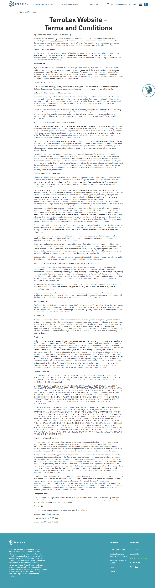

# Terms & Conditions

**Live URL:** https://www.terralex.org/terms-and-conditions
**Local file (target):** new file: terms-and-conditions.html
**Page purpose:** Site terms and conditions (legal). Long-form static legal text that must be locatable, readable, and citable section-by-section.

**Live screenshot:** [../screenshots/19-terms-and-conditions.png](../screenshots/19-terms-and-conditions.png)

## Current state — observations
- **Last-updated date** is buried at the very end of the document — "Effective as of October 4, 2022" — in flat body styling. No prominent dateline at the top, no `<time>` element, no visual treatment.
- **No table of contents, no anchor nav, no jump links.** Users cannot skip to a section; the only way to find e.g. "Arbitration" is to ctrl-F or scroll the entire wall of text.
- **15 H2 sections in a flat list:** Agreement between User and www.terralex.org, Electronic Communications, Your Account, Children Under Thirteen, Links to Third Party Sites/Third Party Services, No Unlawful or Prohibited Use/Intellectual Property, Use of Communication Services, Materials Provided to www.terralex.org or posted on any TerraLex Web Page, International Users, Indemnification, Arbitration, Liability Disclaimer, Termination/Access Restriction, Changes to Terms, Contact Us.
- **No H3 sub-structure** inside dense sections — Liability Disclaimer and IP run as 200–300+ word single paragraphs.
- **Density:** very heavy. Minimal white space between sections, no rule lines, no callouts, no defined-terms styling.
- **Line length** appears to use the default site content column — well over the 65–75ch comfortable measure for legal prose.
- **Navigation chrome** (header / footer) is the same legacy site shell as the rest of terralex.org; no breadcrumb.
- **No print stylesheet, no copy-link-to-section, no back-to-top affordance.**
- **Mobile** behavior unverified but likely inherits the same wide single column, which on small screens at least solves the measure problem but offers no jump-nav substitute.

## What works (Pros)
- **Complete content** — all 15 standard legal sections are present, named consistently with industry norms (Arbitration, Indemnification, Liability Disclaimer, etc.).
- **Stable, predictable H2 outline** — easy to map to a TOC in the redesign without rewriting copy.
- **Single-column, no distractions** — no popovers, no ads; reader stays on text.
- **Section titles are descriptive** — they tell you what's inside without legalese padding.

## What doesn't work (Cons)
- **"Last updated" is at the bottom, in body text** [Content][UX] — the single most-asked question on a T&C page ("when was this changed?") is the hardest thing to find.
- **No table of contents / anchor nav** [UX][Accessibility] — 15 sections with no jump links makes the page effectively unnavigable on desktop and unusable on mobile.
- **Wall-of-text density** [UI][Accessibility] — 200–300 word paragraphs in Liability Disclaimer / IP sections fail WCAG readability heuristics and look intimidating.
- **Line length too wide** [UI][Accessibility] — legal prose at >90ch hurts comprehension; should cap ~65–75ch.
- **No H3 / sub-heading rhythm** [UI] — long sections need internal scaffolding (a-b-c clauses, defined terms, sub-headings) to be scannable.
- **No visual hierarchy between section title and body** [UI] — H2 sits flush with paragraph type at near-equal weight; the eye has nothing to anchor to.
- **No back-to-top, no per-section copy-link** [UX] — citing a clause to a colleague is impossible without a fragment URL.
- **No breadcrumb** [UX] — page is orphaned; user can't tell where it sits in the IA.
- **No print styles** [UX] — legal pages are routinely printed/PDF'd by counsel; default print is unstyled.
- **Generic site shell** [UI] — page inherits the legacy header/footer and offers no visual signal that this is a formal legal document (vs. marketing).
- **Mobile jump-nav missing** [Mobile] — without a TOC the mobile experience is a 15-section infinite scroll.

## Redesign plan
- **Direction:** treat the page as a *readable legal document*, not a marketing page. Narrow measure, generous leading, prominent dateline, persistent TOC, deep-linkable sections. Front-end only — copy is preserved verbatim from the live page, only structure and styling change.
- **Layout:** two-column at desktop — sticky TOC rail (left, ~240px) + reading column (~70ch) on the right. Single column at ≤900px with a collapsed "Jump to section" disclosure pinned to the top of the body.
- **Hero:** minimal. On-light band with eyebrow "Legal", H1 "Terms & Conditions", and a clearly styled "Last updated: 4 October 2022" line using `<time datetime="2022-10-04">` and `ds-eyebrow` + a subtle accent rule. No image, no CTA.
- **Sticky TOC** (`.tc-toc`) — ordered list of all 15 H2 anchors; active section highlighted via IntersectionObserver as the reader scrolls; click = smooth-scroll with `scroll-margin-top` to clear the fixed header.
- **Body sections** (`.tc-section`) — each H2 gets an `id`, a visible "#" link on hover (anchor copy), a top rule, and `scroll-margin-top` for header offset. H3 introduced where the legal copy contains enumerated clauses to break up paragraphs >120 words.
- **Typography:** `ds-h1` for the page title, `ds-h2` for section titles, `ds-h3` for sub-headings, `ds-body-lg` for the reading column, generous `line-height` (~1.7), measure capped at 70ch.
- **Back-to-top** floating button (`.tc-backtop`) appears after the user scrolls past the hero; reuses existing button radius / shadow tokens.
- **Print stylesheet:** hide header / footer / TOC / back-to-top, expand body to full width, force single-column, ensure each H2 starts a new section with `page-break-inside: avoid`.
- **Component reuse from `index.html` / `css/`:** `.site-header` + `.nav-topbar` + `.nav-mega`, `.site-footer`, design tokens (`ds-eyebrow`, `ds-h1`, `ds-h2`, `ds-h3`, `ds-body-lg`, `ds-thin`, `ds-bold`, `ds-accent`, button classes). No hero slider, no `.s3-numbers`, no `.s9-cta`.
- **New page-local CSS only:** `.tc-hero`, `.tc-layout`, `.tc-toc`, `.tc-section`, `.tc-anchor`, `.tc-backtop`, plus a `@media print {}` block.

## Instructions for Claude Code (implementation brief)
1. **Target file:** `terms-and-conditions.html` — new file at repo root. Scaffold from `index.html`'s `<head>` (same font links, same `css/design-system.css` + `css/responsive.css` includes) and copy `.site-header` + `.site-footer` markup verbatim so nav and logo-swap behavior match.
2. **Reuse without modification:** header (`.site-header`, `.nav-topbar`, `.nav-mega`, mobile drawer), footer (`.site-footer`), typography classes (`ds-eyebrow`, `ds-h1`, `ds-h2`, `ds-h3`, `ds-body-lg`, `ds-thin`, `ds-bold`, `ds-accent`), button classes. Do not introduce new global tokens.
3. **Sections to build, in order:**
   1. Global header (reused).
   2. **Hero** (`.tc-hero`) — eyebrow "Legal", H1 "Terms & Conditions", dateline `
<time datetime="2022-10-04">Last updated: 4 October 2022</time>
`. No image, no CTA.
   3. **Two-column body** (`.tc-layout`):
      - Left: **sticky TOC** (`.tc-toc`) — `<nav aria-label="On this page">` containing an ordered list of all 15 H2 anchors. Active link highlighted via IntersectionObserver.
      - Right: **reading column** capped at ~70ch. One `<section class="tc-section" id="...">` per H2; copy pulled verbatim from live page. Add H3 sub-headings where a section paragraph exceeds ~120 words (Liability Disclaimer, IP, Use of Communication Services). Each H2 has a hover-revealed `#` anchor-copy link (`.tc-anchor`).
   4. **Back-to-top** button (`.tc-backtop`) — fixed bottom-right, fades in after 600px scroll, smooth-scrolls to top.
   5. Global footer (reused).
4. **Backend constraint:** no backend changes. All copy is hard-coded in the HTML, verbatim from the live `/terms-and-conditions` page. TOC active-section tracking, smooth scroll, anchor-copy, and back-to-top are all client-side JS only. Anchor-copy uses `navigator.clipboard.writeText(location.origin + location.pathname + '#' + id)`. No CMS, no analytics, no auth.
5. **Acceptance criteria:**
   - Renders without console errors when served via `npx serve . -l 8080` and opened at `http://localhost:8080/terms-and-conditions.html`.
   - Header / footer match `index.html` 1:1 (logo swap on scroll, same mega-menu).
   - Reading column caps at ~70ch and stays readable from 320px to 1440px+.
   - All 15 H2 sections have unique `id`s; TOC links smooth-scroll to them with `scroll-margin-top` clearing the fixed header; active TOC item updates via IntersectionObserver.
   - "Last updated" is wrapped in `<time datetime="2022-10-04">` and visually prominent at the top of the page.
   - Anchor-copy on H2 hover writes the deep link to the clipboard and shows a transient "Copied" tooltip.
   - Back-to-top button appears after 600px scroll and disappears at the top.
   - At ≤900px the layout collapses to a single column and the TOC becomes a `
`-style "Jump to section" disclosure pinned to the top of the body.
   - `@media print` hides header, footer, TOC, and back-to-top; body expands full width; each H2 has `page-break-inside: avoid`.
   - Headings form a valid `h1 → h2 → h3` outline; nav is wrapped in `<nav aria-label="On this page">`; the document has a single `<main>` landmark.
